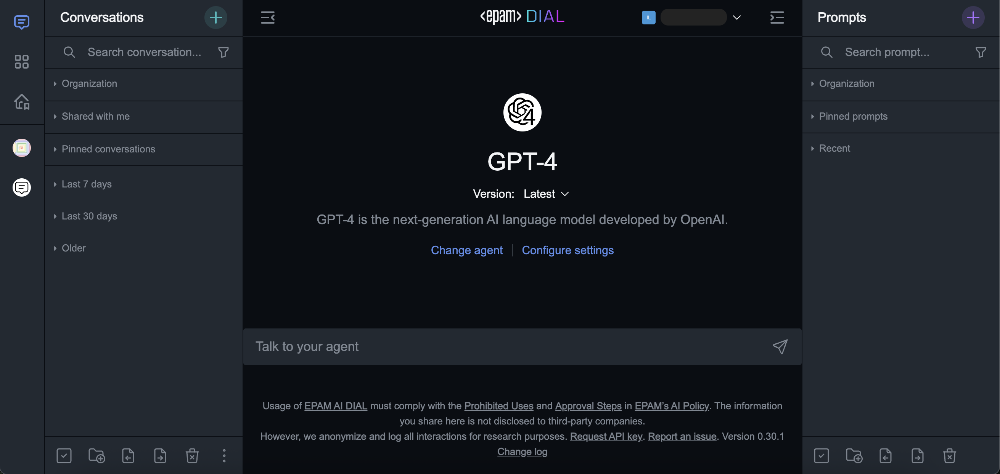

<h1 align="center">
         DIAL Chat
    </h1>
    <p align="center">
        <p align="center">
        <a href="https://dialx.ai/">
          
        </a>
    </p>
<h4 align="center">
    <a href="https://discord.gg/ukzj9U9tEe">
        
    </a>
</h4>

- [overview](#overview)
- [Documentations 📄](#documentations-)
- [Development 🛠️](#development-️)
  - [Install](#install)
  - [Build](#build)
  - [Serve](#serve)
  - [Tests](#tests)
  - [Publish](#publish)
    - [Dry Mode](#dry-mode)

---

## Overview

**DIAL Chat** is a default UI for [DIAL](https://dialx.ai). DIAL can be used as headless system, but UI is recommended to learn the capability.

Originally forked from [chatbot-ui](https://github.com/mckaywrigley/chatbot-ui) and then completely reworked and published under [apache 2.0 license](./LICENSE), while code taken from original repository is still subject to [original MIT license](./license-original). Due to rework we introduced lots of new features such as various IDP support, model side-by-side compare, [DIAL extensions](https://dialx.ai/extension-framework) support, conversation replays, branding and many more.



> [!IMPORTANT]
> This repository is managed as monorepo by [NX](https://nx.dev/) tools.

---

## Documentations 📄

- `DIAL Chat` documentation placed [here](./apps/chat/README.md).
- `DIAL Chat Theming` documentation is placed [here](./docs/THEME-CUSTOMIZATION.md).
- `DIAL Overlay` documentation is placed [here](./libs/overlay/README.md).
- `DIAL Chat Visualizer Connector` documentation is placed [here](./libs/chat-visualizer-connector/README.md).
- `DIAL Visualizer Connector` documentation is placed [here](./libs/visualizer-connector/README.md).
- `DIAL Custom Viewers` documentation is placed [here](./docs/CUSTOM-VIEWERS.md).
- `Isolated view mode` is described in [documentation](https://github.com/epam/ai-dial/blob/main/docs/tutorials/0.user-guide.md#isolated-view-mode).

> [!TIP]
> In [DIAL repository](https://github.com/epam/ai-dial/blob/main/docs/tutorials/0.user-guide.md), you can find a user guide for the DIAL Chat application.

---

## Development 🛠️

To work with this repo we are using NX.

_Note: All commands could be found in scripts section in [package.json](./package.json)._

### Install

```bash
npm i
```

### Build

Run this command to build all projects which support this target (`chat`, `overlay-sandbox`):

```bash
npm run build
```

### Serve

To run the project, it is recommended to use `npm run nx serve` with the specified project name:

```bash
npm run nx serve project-name
```

### Tests

Run this command to run tests for the full repository:

```bash
npm run test
```

### Publish

Run this command to initiate npm publish for all publishable libraries:

```bash
npm run publish -- --ver=*.*.* --tag=* --dry
```

Parameters (all optional):

```
ver - version to publish
tag - distribution tag to publish with (default: 'next')
dry - dry run
```

#### Dry Mode

In `dry` mode, nothing is published, just displayed on the screen:

```bash
npm run publish -- --dry
```

or

```bash
npm run publish:dry
```

---
