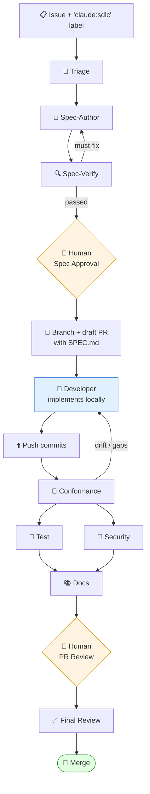
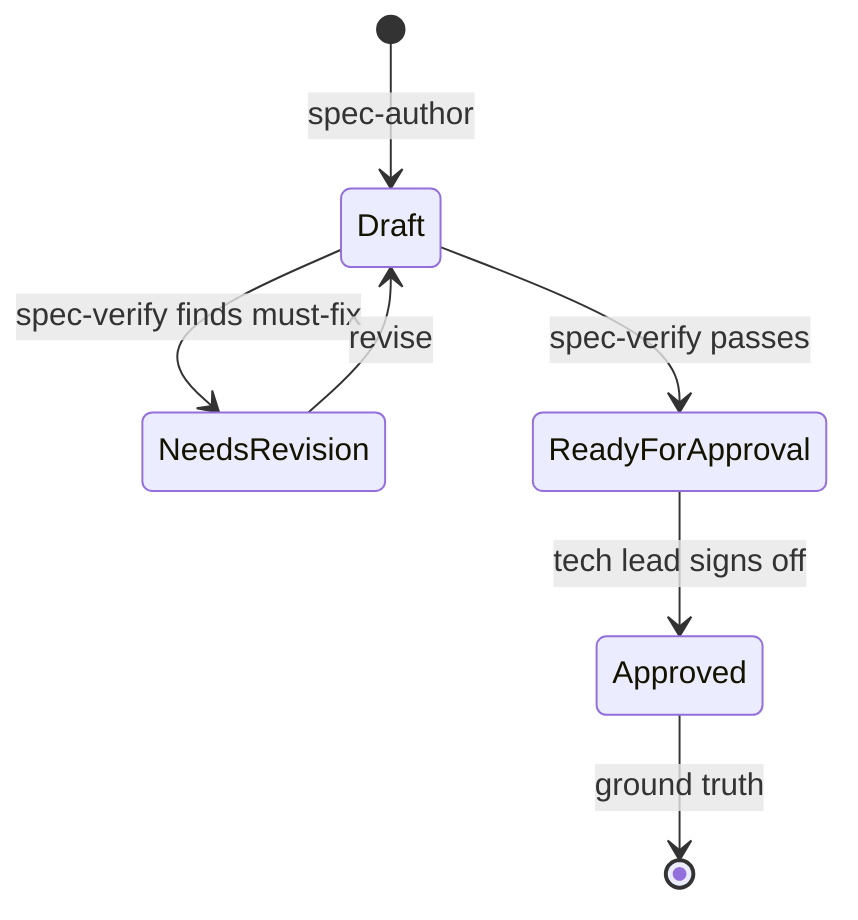
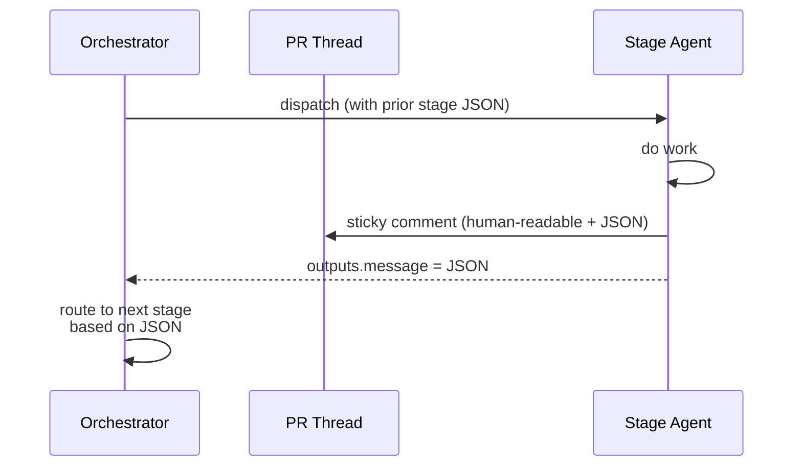
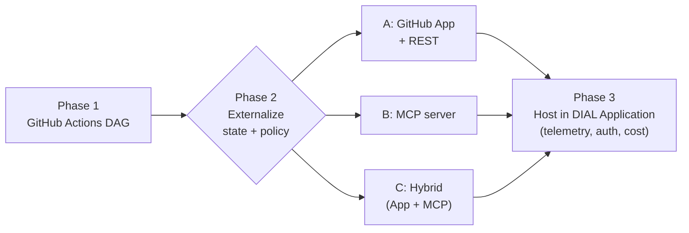

# Claude-Based SDLC Orchestration on GitHub for AI DIAL

A design for spec-driven SDLC verification on GitHub using Claude Code Action. Agents triage issues, draft and verify specifications, then verify human-written implementations against the approved spec. Developers implement; agents review.

---

## Table of Contents

- [High-Level Flow](#high-level-flow)
- [Orchestrator Options](#orchestrator-options)
- [Spec-Driven Mode](#spec-driven-mode)
- [Repo Layout](#repo-layout)
- [Inter-Stage Contract](#inter-stage-contract)
- [Orchestrator Workflow](#orchestrator-workflow)
- [A Stage Workflow](#a-stage-workflow)
- [Worked Example: Issue #4521](#worked-example-issue-4521)
- [What Makes This Work](#what-makes-this-work)
- [Evolution Path](#evolution-path)

---

## High-Level Flow



Two human gates. One developer-driven implementation. Agents handle everything else.

---

## Orchestrator Options

| Option | What | When |
|---|---|---|
| **GitHub Actions** | Reusable workflows + `needs:` DAG, PR as shared state | **Start here.** Native, observable |
| Comment/label router | Slash commands dispatch stages | Stages are optional / human-curated |
| "Lead Claude" + sub-agents | One session with specialized sub-agents | Tight plan→do→verify loops in one job |
| MCP-based orchestrator | Stage tools + state behind MCP | Agents query orchestrator state mid-run |
| DIAL Application | Webhook receiver hosted in DIAL | Orchestrator is a product surface |
| External workflow engine | Temporal / Restate / Inngest | Multi-day flows with durable retries |

**Recommendation**: GitHub Actions for Phase 1, sub-agents within individual stages where useful. See [Evolution Path](#evolution-path) for what comes next.

---

## Spec-Driven Mode

The SDLC is anchored on a versioned spec, not the issue text. The spec is the contract between business intent and implementation.

### Triage

Runs the moment an issue gets the `claude:sdlc` label, before any spec work. Maps the issue to code paths, pulls related context (linked PRs, design docs, threat model sections), estimates complexity and risk, and flags blockers — duplicates, missing dependencies, ambiguous issues — so token spend stops early on anything malformed.

Outputs sticky JSON plus `specs/issue-NNNN/CONTEXT.md`, a curated starting point that spec-author, the developer, and final-review all reuse. Read-only tools except for writing `CONTEXT.md` itself.

### Spec template (`specs/issue-NNNN/SPEC.md`)

- **Intent** — what problem, who for, why now
- **Functional Requirements** — `FR-1`, `FR-2`, … numbered, testable
- **Non-Functional Requirements** — perf / security / observability, with numbers
- **API / Config Contract** — exact shapes, defaults, validation
- **Acceptance Criteria** — Given/When/Then, one per FR minimum
- **Out of Scope** — explicit non-goals
- **Open Questions** — flagged for human resolution before approval

Stable IDs (`FR-3`, `AC-2`, `NFR-sec-2`) thread through the rest of the pipeline.

### Spec lifecycle



### Spec-Author

Drafts `SPEC.md` from the issue plus triage `CONTEXT.md` plus the touched code. Sub-agents recommended: one for "current state," one for "options analysis," one for drafting. When spec-verify returns must-fix findings, the orchestrator re-dispatches with the findings as context for a targeted revision, not a full rewrite. Edit access scoped to `specs/` only.

### Spec-Verify

Separate agent run, read-only tools. Job: attack the spec, not extend it — the author can't credibly verify their own work due to sunk-context bias. Must-fix findings block advancement.

| Check | What it looks for |
|---|---|
| Completeness | Every issue AC mapped to an FR |
| Consistency | No contradictions between FRs, NFRs, contract |
| Testability | Every requirement has a verification path |
| Specificity | Numbers where it matters, edge cases named |
| Architectural fit | Cross-referenced against DIAL design docs |
| Scope discipline | Nothing in spec unjustified by the issue |

### Conformance

Runs first after every developer push. Maps each requirement ID to implementing code and covering tests; flags gaps (missing coverage) and drift (spec says one thing, code does another). Cheap (~2 min), fails fast, saves tokens on downstream stages running against a wrong target. Writes `coverage.json`. Read-only.

### Test

Derives tests from spec acceptance criteria, not from implementation — each test maps to a requirement ID. Adds tests where ACs lack coverage (edit scoped to `test/` paths), runs the suite, reports coverage. Tests that don't map to any spec requirement are flagged as scope creep, not deleted — the developer decides.

### Security

Trivy first (deterministic scanner for known CVEs in deps), Claude second (spec NFR-sec-* requirements, threat-model fit, auth and multi-tenancy patterns). Read-only — finds, never fixes. SARIF uploaded to GitHub Security tab.

### Docs

Regenerates user-facing docs from the spec's API/Config Contract section — config keys, defaults, error shapes come from the spec, not reverse-engineered from code. Edit scoped to `docs/`. Translated docs flagged for human review; never auto-translated.

### Final Review

Skeptic Claude, read-only. Reads every stage's sticky JSON plus the final diff. Catches inconsistencies between what stages claimed and what's actually merging (e.g., test stage claimed AC-3 covered but the test was deleted in a later commit). No tools beyond `Read` — approves or flags.

### Spec as structured data

`SPEC.md` is git-versioned human-readable source of truth. A pre-commit hook produces `spec.json` (validated against `spec.schema.json`) for programmatic queries by conformance, test, and docs stages.

---

## Repo Layout

```
.github/
├── workflows/
│   ├── sdlc-orchestrator.yml
│   ├── stage-triage.yml
│   ├── stage-spec-author.yml
│   ├── stage-spec-verify.yml
│   ├── stage-conformance.yml
│   ├── stage-test.yml
│   ├── stage-security.yml
│   ├── stage-docs.yml
│   ├── stage-final-review.yml
│   └── stage-help.yml              # /claude help dispatcher
├── claude/
│   ├── prompts/                    # one .md per stage
│   ├── mcp/config.json             # gitlab, dial-context MCPs
│   └── schemas/                    # stage-message + spec
specs/
└── issue-NNNN/
    ├── SPEC.md                     # human-readable, source of truth
    ├── spec.json                   # parsed, machine-queryable
    ├── CONTEXT.md                  # triage findings
    └── coverage.json               # written by conformance
CODEOWNERS                          # specs/ owned by tech leads
```

`specs/` has stricter CODEOWNERS than code — only tech leads can change approved specs.

---

## Inter-Stage Contract



Sticky comment format:

```json
{
  "stage": "security",
  "status": "passed_with_findings",
  "issue": "#4521",
  "spec_id": "issue-4521",
  "spec_version": "1.2",
  "summary": "1 medium finding on NFR-sec-2; non-blocking",
  "findings": [{
    "severity": "medium",
    "requirement_ref": "NFR-sec-2",
    "file": "core/.../RateLimiter.java",
    "line": 142,
    "message": "API key used as Redis key; spec requires HMAC",
    "suggested_fix": "hash with deployment salt"
  }],
  "next_recommended": ["dev:apply_fix"],
  "cost_usd": 0.42,
  "agent_run_id": "9928374"
}
```

Humans read `summary` + findings; machines read JSON. `spec_id` + `spec_version` flag stale outputs when the spec changes.

---

## Orchestrator Workflow

```yaml
# .github/workflows/pr-workflows-orchestrator.yml
name: SDLC Orchestrator
on:
  issues:           { types: [labeled] }
  pull_request:     { types: [opened, synchronize, ready_for_review] }
  issue_comment:    { types: [created] }

permissions: { contents: write, pull-requests: write, issues: write }

jobs:
  # ---------- Spec chain (issue events) ----------
  triage:
    if: github.event_name == 'issues' && github.event.label.name == 'claude:sdlc'
    uses: ./.github/workflows/stage-triage.yml
    secrets: inherit

  spec-author:
    needs: triage
    uses: ./.github/workflows/stage-spec-author.yml
    secrets: inherit

  spec-verify:
    needs: spec-author
    uses: ./.github/workflows/stage-spec-verify.yml
    secrets: inherit

  gate-spec-approval:
    needs: spec-verify
    if: fromJSON(needs.spec-verify.outputs.message).status == 'passed'
    runs-on: ubuntu-latest
    environment: spec-approval
    steps:
      - run: ./scripts/create-dev-branch.sh   # branch + draft PR with SPEC.md

  # ---------- Verification chain (PR events) ----------
  conformance:
    if: github.event_name == 'pull_request'
    uses: ./.github/workflows/stage-conformance.yml
    secrets: inherit

  test:
    needs: conformance
    uses: ./.github/workflows/stage-test.yml
    secrets: inherit

  security:
    needs: conformance
    uses: ./.github/workflows/stage-security.yml
    secrets: inherit

  docs:
    needs: [conformance, test]
    uses: ./.github/workflows/stage-docs.yml
    secrets: inherit

  gate-pr-review:
    needs: [test, security, docs]
    runs-on: ubuntu-latest
    environment: pr-review
    steps:
      - run: echo "Awaiting human approval"

  final-review:
    needs: gate-pr-review
    uses: ./.github/workflows/stage-final-review.yml
    secrets: inherit
```

Two trigger paths in one file: issue events drive the spec chain; PR `synchronize` events drive verification on every developer push.

---

## A Stage Workflow

```yaml
# .github/workflows/stage-security.yml
name: SDLC Stage / Security
on:
  workflow_call:
    outputs:
      message: { value: ${{ jobs.run.outputs.message }} }

jobs:
  run:
    runs-on: ubuntu-latest
    outputs: { message: ${{ steps.extract.outputs.json }} }
    steps:
      - uses: actions/checkout@v4
      - run: trivy fs --format sarif -o reports/trivy.sarif .
      - uses: anthropics/claude-code-action@v1
        with:
          anthropic_api_key: ${{ secrets.ANTHROPIC_API_KEY }}
          prompt_file: .github/claude/prompts/security.md
          mcp_config: .github/claude/mcp/config.json
          allowed_tools: "Read,Grep,Glob,Bash(git diff:*),mcp__dial-context__*"
          claude_args: "--max-turns 25"
      - id: extract
        run: ./scripts/render-stage-comment.sh security >> $GITHUB_OUTPUT
```

### Tool allowlists per stage

| Stage | Read | Edit | Bash | Notes |
|---|:-:|:-:|:-:|---|
| Triage | ✅ | ❌ | ❌ | |
| Spec-Author | ✅ | `specs/` only | ❌ | |
| Spec-Verify | ✅ | ❌ | ❌ | Skeptic |
| Conformance | ✅ | ❌ | ❌ | |
| Test | ✅ | test paths | test runner | |
| Security | ✅ | ❌ | `git diff` | |
| Docs | ✅ | `docs/` only | ❌ | |
| Final Review | ✅ | ❌ | ❌ | Skeptic |
| `/claude help` | ✅ | ❌ | ❌ | On-demand |

---

## Worked Example: Issue #4521

**Issue**: Per-API-key rate limiting on chat completions; config under `app.rate-limits.api-keys[]`; 429 with `Retry-After`; exempt health endpoints.

```mermaid
gantt
    title Issue #4521 timeline
    dateFormat HH:mm
    axisFormat %H:%M

    section Spec
    Triage              :done, t1, 09:00, 1m
    Spec-Author v1.0    :done, t2, after t1, 3m
    Spec-Verify (2 fix) :crit, t3, after t2, 2m
    Spec-Author v1.1    :done, t4, after t3, 2m
    Spec-Verify (pass)  :done, t5, after t4, 2m
    Human approval      :milestone, ha, after t5, 0m

    section Dev
    Developer impl      :active, d1, after ha, 240m

    section Verify
    Conformance         :v1, after d1, 2m
    Test                :v2, after v1, 3m
    Security            :v3, after v1, 2m
    Docs                :v4, after v2, 2m
    Human PR review     :milestone, hr, after v4, 0m
    Final Review        :v5, after hr, 2m
    Merge               :milestone, after v5, 0m
```



### Spec excerpt (after v1.1 revision)

```markdown
## Functional Requirements
- FR-1: Enforce per-API-key rate limit before forwarding to model
- FR-2: When API-key and deployment limits both apply, most restrictive wins
- FR-3: Return 429 + Retry-After (sub-second refill → round up to 1)
- FR-4: Health endpoints exempt

## Non-Functional Requirements
- NFR-perf-1: < 2ms p99 added latency (measured via JMH benchmark)
- NFR-sec-2: Redis keys use HMAC(key_id, salt)
- NFR-obs-1: Emit dial_rate_limit_hits_total{scope="api_key"} on 429

## Acceptance Criteria
- AC-1 (FR-1): 61 requests with rpm=60 → 61st returns 429
- AC-2 (FR-2): key rpm=60 + deployment rpm=100 → key wins
- AC-3 (FR-3): Retry-After ∈ [1, 60]
- AC-4 (FR-4): Health 200 OK regardless
- AC-5 (NFR-sec-2): Redis MONITOR shows no plaintext key_id
```

### Stage outputs (condensed)

> **🔎 Triage** — Touches `core/.../limiter/`, multi-tenant + hot path. Recommends short spec before implementation.

> **🔍 Spec-Verify v1.0** — ❌ **2 must-fix**: AC-3 silent on sub-second Retry-After; NFR-perf-1 missing measurement methodology. v1.1 addresses both, passes.

> **🚦 Spec Approval** — Tech lead reviews `SPEC.md`, resolves Q1/Q2 in comments, approves. Spec locked.

> **👤 Developer** — Pulls branch, runs `claude --add-dir specs/issue-4521` locally, implements over ~4h across 2 days. Mid-implementation comments `/claude help "Redis fail-open pattern?"` and gets a scoped read-only reply pointing to existing `Resilience4j` use in `RateLimitService.java:204`.

> **🔗 Conformance** — ❌ **1 gap, 1 drift**: NFR-perf-1 has no latency test; metric label `limit_scope` doesn't match spec's `scope`. Developer fixes both.

> **🧪 Test** — All 5 ACs have passing tests. Coverage 94%. JMH benchmark: p99 = 0.8ms ✅

> **🔐 Security** — Clean. HMAC verified, no plaintext keys logged, threat model §4.2 satisfied.

> **📚 Docs** — Config docs regenerated from spec contract. Translated docs flagged for human.

> **🚦 PR Review** — Tech lead approves.

> **✅ Final Review** — Stage outputs consistent with diff. Approving.

---

## What Makes This Work

**The spec is the contract.** Modifying approved `SPEC.md` requires spec-verify re-run and re-approval. Without this discipline, "spec-driven" decays into "spec-shaped commit message."

**Spec-Verify is a different read-only agent.** The author can't credibly attack their own work.

**Conformance runs first.** Cheap, fails fast if implementation drifted; saves tokens on downstream stages against wrong target.

**Sticky comments, not new comments.** Markers like `<!-- dial-sdlc:security -->` updated in place. PR stays readable across reruns.

**One JSON contract, validated.** Invalid JSON fails the stage loudly — downstream depends on it.

**Stricter CODEOWNERS on `specs/`** than on code.

**Reentry by comment.** `/claude rerun <stage>`, `/claude help "..."`, `/claude skip <stage>` for humane mid-flow control.

---

## Evolution Path

Phase 1 hits limits when routing logic outgrows YAML — conditional stage skipping, severity-based escalation, cross-PR history.



| Phase 2 option | When it wins |
|---|---|
| **A — GitHub App + REST** | GitHub-only, orchestrator calls agents, no agent introspection |
| **B — MCP server** | Agents query orchestrator state mid-run, or non-GH reuse matters |
| **C — Hybrid** | Both of the above |

Phase 1 stage workflows are the execution layer at every phase; only routing logic moves out.
