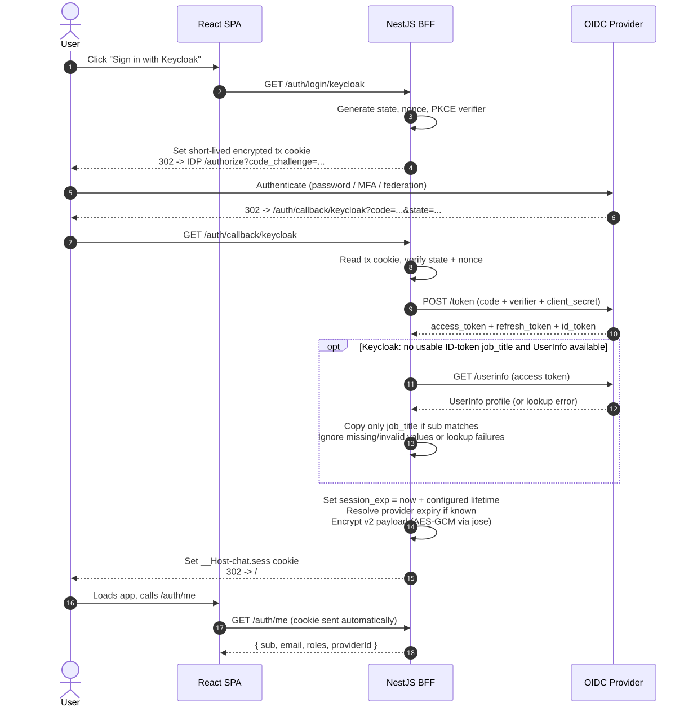
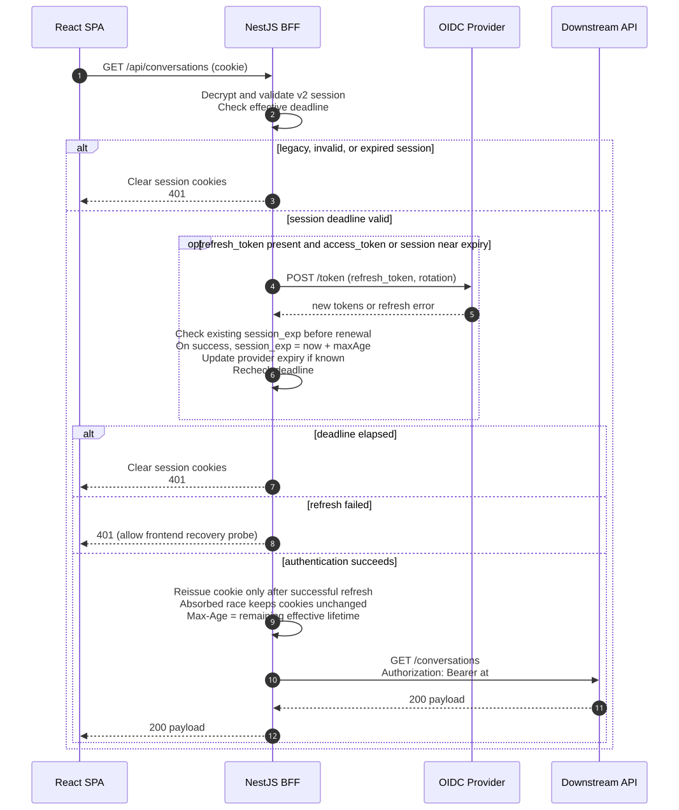
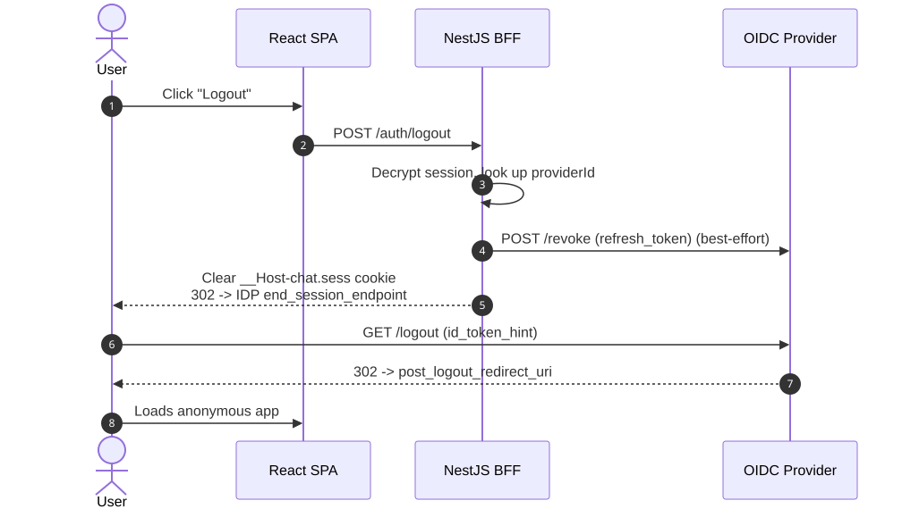
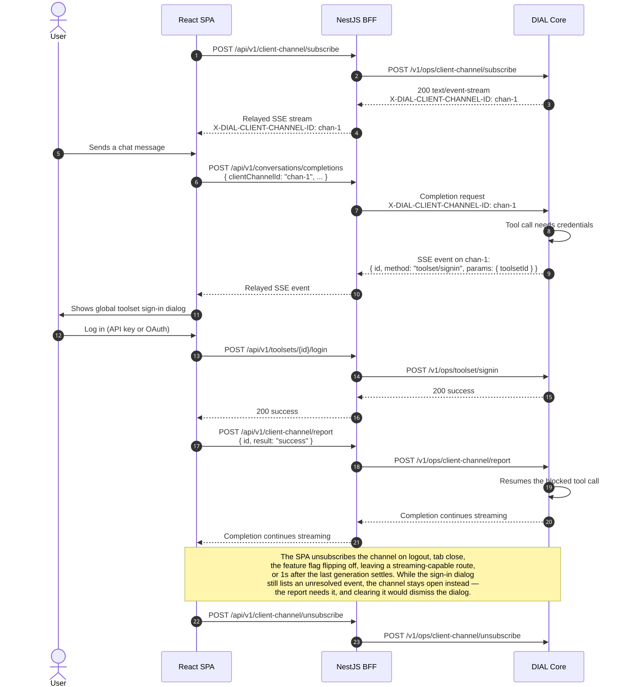

# Auth Architecture: Stateless BFF with Encrypted Cookie Session

**Project:** AI DIAL Chat (React/Vite + NestJS)
**Version:** 1.0 | **Date:** 2026-05-14 | **Status:** Implemented

---

## 1. Goals and Constraints

| Requirement                                                      | Decision                                                    |
| ---------------------------------------------------------------- | ----------------------------------------------------------- |
| Strong security against XSS token theft                          | Tokens MUST NOT be readable by browser JavaScript           |
| Multiple identity providers (Keycloak, Auth0, Okta, Entra ID, …) | Provider-neutral OIDC layer on the server                   |
| No Redis or external session store available                     | Session state lives **inside an encrypted HttpOnly cookie** |
| Greenfield React/Vite SPA + NestJS API                           | NestJS is the confidential OIDC client (BFF)                |
| Compatible with IETF BCP 212 (browser-based apps)                | BFF pattern, code + PKCE, no implicit flow                  |

The chosen pattern is a **Stateless Backend-for-Frontend (BFF)**: NestJS performs the full OIDC dance, encrypts the resulting tokens with an AEAD cipher, and sends them back to the browser as `HttpOnly` cookies. No tokens are ever exposed to JavaScript, and no server-side session store is needed.

---

## 2. High-Level Architecture



_Source: [`auth-diagrams/01-high-level-architecture.mmd`](./auth-diagrams/01-high-level-architecture.mmd)_

Key properties:

- The SPA never touches `access_token` or `refresh_token`.
- The cookie payload is opaque to the browser (AEAD-encrypted).
- The BFF decides which IdP to use per request via `:providerId`.
- The API tier remains stateless — every NestJS pod can decrypt the cookie with the shared key.

---

## 3. Cookie Design



_Source: [`auth-diagrams/07-cookie-structure.mmd`](./auth-diagrams/07-cookie-structure.mmd) — browser cookie jar → JWE on the wire → server-side plaintext._

### 3.1 Cookie Contents

The session is a JWE (`alg: dir`, `enc: A256GCM`) whose plaintext payload is:

```json
{
  "v": 1,
  "sid": "0d3e6a…",
  "providerId": "keycloak",
  "sub": "user-123",
  "at": "<access_token>",
  "rt": "<refresh_token>",
  "at_exp": 1715600000,
  "rt_exp": 1715686400,
  "iat": 1715596400,
  "claims": { "roles": ["admin"], "email": "u@x.io" }
}
```

### 3.2 Cookie Attributes

| Attribute  | Value                                                 | Reason                                                                                                       |
| ---------- | ----------------------------------------------------- | ------------------------------------------------------------------------------------------------------------ |
| `HttpOnly` | `true`                                                | JS cannot read or write                                                                                      |
| `Secure`   | `true` by default                                     | HTTPS only; may be disabled only for local HTTP smoke testing                                                |
| `SameSite` | `Lax` by default; `None` for secure overlay embedding | Blocks most CSRF in the normal app; allows cross-site iframe requests only when overlay embedding is enabled |
| `Path`     | `/`                                                   | One cookie for whole app                                                                                     |
| `Max-Age`  | `rt_exp`                                              | Lives as long as the refresh token                                                                           |
| `Name`     | `__Host-chat.sess`                                    | `__Host-` prefix locks host/path; runtime drops this prefix when `AUTH_COOKIE_SECURE=false`                  |

### 3.3 Size Considerations

Browsers cap individual cookies at ~4 KB. Entra ID access tokens can be large, so the BFF writes the encrypted session as one cookie while it fits, and splits it into numbered chunks when it does not:

- `__Host-chat.sess` — single-cookie mode
- `__Host-chat.sess.0`, `__Host-chat.sess.1`, ... — chunked mode

Each chunk uses the same `HttpOnly`, `Secure`, resolved `SameSite`, `Path=/`, and `Max-Age` attributes as the single cookie. When local `AUTH_COOKIE_SECURE=false` is enabled, the runtime names are `chat.sess`, `chat.sess.0`, `chat.sess.1`, and so on.

### 3.4 Encryption Keys

- Active key + 1–2 previous keys for rotation without forced logout.
- 32-byte random secrets from env or KMS.
- Recommended library: [`jose`](https://github.com/panva/jose) (`CompactEncrypt` / `compactDecrypt`) — standards-based, supports key rotation, no extra deps. Alternative: [`iron-session`](https://github.com/vvo/iron-session) ergonomic wrapper.

---

## 4. Multi-Provider Registry



_Source: [`auth-diagrams/02-provider-registry.mmd`](./auth-diagrams/02-provider-registry.mmd)_

Each provider entry is a confidential OIDC client configured through `openid-client`:

```ts
type ProviderConfig = {
  id: string;
  issuer: string;
  clientId: string;
  clientSecret: string;
  scope: string;
  audience?: string;
  rolesClaim?: string;
  adminRoles?: string[];
  postLogoutRedirectUri: string;
};
```

Login URLs become `/auth/login/:providerId?callbackUrl=<app-url>`. The active provider is encoded in the session, so refresh and logout always use the correct IdP; the validated `callbackUrl` is encoded in the short-lived transaction cookie so the callback can return the browser to the correct SPA origin/page.

---

## 5. Flow Diagrams

### 5.1 Login Flow (Authorization Code + PKCE)



_Source: [`auth-diagrams/03-login-flow.mmd`](./auth-diagrams/03-login-flow.mmd)_

The transient `tx` cookie holds only `{ state, nonce, code_verifier, providerId }`, lives 5–10 minutes, and is deleted immediately after callback.

#### 5.1.1 Overlay External Login

When Chat runs inside an overlay iframe and the session bootstrap resolves as unauthenticated, the SPA does not start the normal automatic redirect inside the iframe. While app config is still loading in a framed window, the protected route tree is not rendered yet, so the normal redirect cannot race ahead before overlay eligibility is known. External IdP pages can block iframe rendering with `X-Frame-Options` or `frame-ancestors`, so the overlay instead renders a login gate with a user-triggered "Log in" action.

Clicking the action opens the existing BFF login flow in a new browser tab/window:

1. The overlay opens `/login?callbackUrl=<encoded-overlay-close-url>` with `window.open(..., '_blank')`, so browser settings decide whether this is a tab or a separate window. The callback URL points to the same-origin `/overlay-close` route.
2. The provider picker still uses `GET /api/v1/auth/login/:providerId`, so the backend OIDC transaction and encrypted session cookie handling remain unchanged.
3. After `GET /api/v1/auth/callback/:providerId` sets the session cookie, the BFF redirects the external auth tab/window to `/overlay-close`; that route calls `window.close()` and renders no UI.
4. The iframe polls through `UserContext.refresh({ setLoading: false })`, whose frontend API path calls `GET /api/v1/auth/me`, until the newly established cookie is observable from the iframe context. That authenticated current-user response is the completion signal, matching the old chat's reliable overlay auth behavior. Polling starts after one full 5 second interval, each next poll is scheduled only after the previous one settles, and the successful refresh updates `UserContext` without reloading the iframe. The login attempt has no hard polling timeout: after 2 minutes the gate shows a retryable long-wait message and later polls run every 15 seconds until success, replacement by another login attempt, or unmount.

When logout is confirmed inside an overlay, the SPA clears the current user state but does not navigate the iframe to the top-level `/login` route. The existing protected route remains under `RequireAuth`, which replaces it with the same external login gate as soon as the status becomes unauthenticated. Normal, non-overlay logout continues to navigate to `/login`.

For cross-site overlay hosts, the session cookie must be sent from a third-party iframe after being set in the top-level external auth tab/window. When `OVERLAY_ENABLED=true`, `ALLOWED_IFRAME_ORIGINS` is non-empty, and secure cookies are enabled, the backend therefore emits auth cookies with `SameSite=None; Secure`. Local insecure cookies keep `SameSite=Lax`; cross-site overlay authentication should be tested over HTTPS.

The external auth window receives no token, session id, or credential material from the iframe; it receives only the same-origin `callbackUrl`. Popup/tab blocked paths leave the login gate visible with a retry option. While an attempt is waiting, the login controls remain available; selecting one clears the previous attempt's timers, best-effort closes its auth window, and starts the replacement attempt. Popup `closed` observations are not used as completion signals because IdP COOP headers can make opener-window signals unreliable after provider navigation. No backend endpoint or cookie payload change is required for this flow.

### 5.2 Authenticated API Request with Transparent Refresh



_Source: [`auth-diagrams/04-api-request-refresh.mmd`](./auth-diagrams/04-api-request-refresh.mmd)_

### 5.3 Logout (Federated)



_Source: [`auth-diagrams/05-logout-flow.mmd`](./auth-diagrams/05-logout-flow.mmd)_

### 5.4 Cross-Pod Stateless Decryption



_Source: [`auth-diagrams/06-cross-pod-stateless.mmd`](./auth-diagrams/06-cross-pod-stateless.mmd)_

Any pod can decrypt any cookie because all pods share the same active key + previous keys. No session affinity is required.

### 5.5 Interactive Sign-In During a Completion (Toolsets and Application External Services)



_Source: [`auth-diagrams/08-toolset-signin-interrupt.mmd`](./auth-diagrams/08-toolset-signin-interrupt.mmd) — the same subscribe/report/unsubscribe shape covers both event kinds described below; a dedicated diagram was not added since the only difference is the RPC `method`/payload and which BFF module handles the login step._

**This is a separate flow from application OIDC login (5.1) and does not touch the session cookie.** The user is already authenticated to Chat; this flow lets DIAL Core ask that already-authenticated user to (re)supply credentials mid-completion, via a generic client-channel RPC mechanism, for either of two distinct resource kinds:

- **Toolsets** — a `toolset/signin` event, handled by `apps/chat-api/src/toolsets/` (`POST /api/v1/toolsets/{name}/login|logout`).
- **Application external services** — an `external-service/signin` event (`params.url` identifying an `applications/{bucket}/{app}/external_services/{serviceId}` resource), handled by `apps/chat-api/src/external-services/` (`GET /api/v1/external-services/{appId}/{serviceId}`, `POST .../signin`, `POST .../signout`), proxying DIAL Core's `GET /v1/applications/{appId}/external-services/{id}` and `POST /v1/ops/external-service/signin|signout`.

Both kinds share the exact same channel plumbing:

- The SPA subscribes once per session to `POST /api/v1/client-channel/subscribe`, a BFF-relayed SSE stream proxying DIAL Core's own `/v1/ops/client-channel/subscribe`. The BFF never exposes the session's access token to the browser — it stays server-side, same as every other BFF-proxied call.
- The assigned channel id travels with subsequent completion requests (`X-DIAL-CLIENT-CHANNEL-ID`), so Core can correlate a `toolset/signin` or `external-service/signin` event back to the specific blocked tool call.
- Either event kind surfaces as a row in the same global `SigninInterruptDialog`; the user logs in with the resource's own API-key/OAuth mechanics (toolset logins are unchanged from the Catalog/Toolset-Editor flows; the OAuth popup/callback/`BroadcastChannel` handshake is shared verbatim, parameterized by which BFF sign-in call the callback should submit to), and the result is reported back on the same channel (`POST /api/v1/client-channel/report`) so Core can resume or terminate the tool call.
- Gated behind the same `liveChatInteraction` feature flag (`apps/chat-api/src/app-config/config-registry/config-registry.constants.ts`) for both event kinds — no separate flag; unsubscribes on logout, tab close, or the flag flipping off.
- OAuth (either kind) opens an external-provider popup and tracks it from the initiating Chat tab. The
  Chat response therefore uses `Cross-Origin-Opener-Policy: same-origin-allow-popups` (rather
  than Helmet's `same-origin` default), preventing provider navigation from severing the
  opener's `WindowProxy` and producing a false `popup.closed` cancellation. Before navigating
  externally, the popup still sets its own `window.opener` to `null` to prevent reverse tabnabbing.
  After completing login, the callback removes the authorization code from its address bar,
  writes a non-secret completion marker into its own same-origin URL, and repeats the result over
  `BroadcastChannel` until the initiating tab acknowledges it. The initiating tab keeps listening
  when a cross-origin navigation makes its retained `WindowProxy` appear closed, consumes either
  the channel result or URL marker, and sends the acknowledgement before refreshing toolset
  status. The callback then closes itself, which still works when the opener's stale
  `WindowProxy` cannot close it. A real manual close is treated as cancellation when focus returns
  to the initiating tab. OAuth codes and credentials are never persisted by this handoff.

---

## 6. NestJS Module Layout (Shipped)

The auth domain keeps its public NestJS entrypoints at `auth/` root and groups internal
implementation by concern. Tests live under `auth/tests/`, mirroring the source concern folders.

```
apps/chat-api/src/auth/
├── auth.module.ts                      # wires controllers + services; SessionGuard + CsrfGuard as APP_GUARDs
├── auth.controller.ts                  # /api/v1/auth/* endpoints
├── cookies/
│   └── cookie-options.ts               # cookie names, chunking, read/write helpers
├── csrf/
│   └── csrf.guard.ts                   # double-submit CSRF guard (Origin check + X-CSRF-Token header)
├── dto/
│   ├── provider-id-param.dto.ts        # :providerId with @Matches allowlist
│   ├── auth-callback.query.dto.ts      # code, state, iss, session_state, error, error_description, scope, authuser, hd, prompt (Google appends these)
│   └── login-query.dto.ts              # callbackUrl for app return after login
├── keys/
│   └── keys.service.ts                 # active + previous keys from env (hex, validated on init)
├── providers/
│   ├── provider-registry.service.ts    # per-provider env assembly + struct-validate + Issuer.discover
│   └── provider.types.ts               # ProviderConfig with class-validator decorators
├── refresh/
│   └── refresh.service.ts              # server-side token refresh + per-pod sid-keyed mutex
├── session/
│   ├── express.d.ts                    # Request.user augmentation
│   ├── session.guard.ts                # global APP_GUARD; isPublic skip, refresh on near-expiry
│   ├── session.service.ts              # JWE encrypt/decrypt (jose A256GCM)
│   └── session.types.ts                # SessionPayload, SessionUser
├── tests/
│   ├── auth.controller.spec.ts         # supertest integration
│   ├── csrf/csrf.guard.spec.ts
│   ├── keys/keys.service.spec.ts
│   ├── providers/provider-registry.service.spec.ts
│   ├── refresh/refresh.service.spec.ts
│   ├── session/session.guard.spec.ts
│   ├── session/session.service.spec.ts
│   └── utils/callback-url.util.spec.ts
└── utils/
    └── callback-url.util.ts            # validates and normalizes callbackUrl
```

Public endpoints:

| Method | Path                                            | Purpose                                                                        |
| ------ | ----------------------------------------------- | ------------------------------------------------------------------------------ |
| GET    | `/auth/providers`                               | List of available providers for the UI                                         |
| GET    | `/auth/login/:providerId?callbackUrl=<app-url>` | Start login (sets `tx` cookie with validated app return URL, redirects to IdP) |
| GET    | `/auth/callback/:providerId`                    | Exchange code, set session cookie, redirect to validated `callbackUrl`         |
| GET    | `/auth/me`                                      | Return current user profile (no tokens)                                        |
| POST   | `/auth/logout`                                  | Revoke + clear cookie + federated logout                                       |
| POST   | `/auth/refresh`                                 | Optional explicit refresh (also done implicitly)                               |

The session guard is applied globally to `/api/*` routes; everything except `/auth/*` requires a valid decrypted cookie.

---

## 7. Security Checklist

Testing instructions for the currently implemented slices live in
[`testing-current-auth-implementation.md`](./testing-current-auth-implementation.md).

| Risk                         | Mitigation                                                                                                                                 |
| ---------------------------- | ------------------------------------------------------------------------------------------------------------------------------------------ |
| XSS reads tokens             | `HttpOnly` cookie + AEAD encryption; tokens never in JS                                                                                    |
| CSRF on mutating endpoints   | Double-submit CSRF token + default `SameSite=Lax` + `Origin/Sec-Fetch-Site` checks; overlay `SameSite=None` still requires CSRF validation |
| Refresh token replay         | Refresh token rotation; `sid`/`jti` in payload; reject reused token                                                                        |
| Cookie tampering             | AES-GCM authenticated tag; decryption fails on any byte change                                                                             |
| Key compromise               | Key rotation with `kid` header; previous keys for grace period                                                                             |
| Session fixation             | New `sid` generated on every login                                                                                                         |
| Open redirect on callback    | Strict IdP `redirect_uri` allow-list plus BFF-side `callbackUrl` validation against allowed application origins                            |
| Token in URL fragment        | Not used — Authorization Code only, never implicit                                                                                         |
| Cookie size overflow (Entra) | Split encrypted session value across numbered cookie chunks                                                                                |
| Multi-tab refresh race       | Per-pod in-memory mutex on `sid`; idempotent refresh                                                                                       |

Mandatory transport: HTTPS everywhere, HSTS, `Secure` cookies, strict CSP (`script-src 'self'`).

---

## 8. Trade-offs vs. Other Options

| Option                                | Tokens in JS | Multi-provider | No Redis         | Refresh reliability       |
| ------------------------------------- | ------------ | -------------- | ---------------- | ------------------------- |
| Pure SPA OIDC                         | Yes (risk)   | Manual         | Yes              | Iframe broken             |
| Hybrid (SPA + JWKS in API)            | Yes (risk)   | Manual         | Yes              | Iframe broken             |
| **BFF + encrypted cookie (this doc)** | **No**       | **Native**     | **Yes**          | **Server-side**           |
| BFF + Redis session                   | No           | Native         | No (needs Redis) | Server-side               |
| Express auth adapter                  | No           | Built-in       | Yes (JWE cookie) | Server-side; experimental |

The proposed pattern is the only column that scores well on **all four** of your constraints simultaneously.

---

## 9. Open Decisions — Resolutions

1. **Cookie shape**: single encrypted cookie with both tokens while the value is ≤ 3800 bytes. Larger values are split into numbered chunks (`<name>.0`, `<name>.1`, ...). The BFF reassembles chunks before decrypting, and clears stale chunks whenever it writes a new session cookie.

2. **Audience strategy**: the SPA always calls through the BFF (`/api/*`). DIAL Core is not called directly from the browser, so the cookie domain scope is the same origin.

3. **Cookie domain**: same origin (SPA static files served by the same NestJS process via `ServeStaticModule`). `__Host-` prefix used by default — locks to host, path `/`, and requires `Secure`. For local HTTP smoke testing, `AUTH_COOKIE_SECURE=false` relaxes `Secure` and drops the `__Host-` prefix at runtime.

4. **Logout policy**: best-effort `end_session_endpoint` redirect when the provider advertises one; graceful fallback to `/` otherwise. Token revocation attempted before redirect (best-effort, non-fatal).

5. **Provider list scope for v1**: provider-neutral — any of the 9 supported OIDC providers works via its discrete `AUTH_{PROVIDER}_*` env vars (see `apps/chat-api/README.md`). Keycloak and Auth0 are smoke-tested; Okta and Entra ID work but are not yet regression-tested.

6. **Key management**: env-only for v1 (`AUTH_SESSION_SECRET` / `AUTH_SESSION_PREV_SECRET`). KMS integration deferred. Key rotation procedure: set old active key as `AUTH_SESSION_PREV_SECRET`, generate new key for `AUTH_SESSION_SECRET`, redeploy. Existing sessions decrypt via the previous key for one grace period.

7. **CSRF strategy**: double-submit pattern — CSRF token sealed inside the JWE (unreadable by JS), exposed to the SPA via the `X-CSRF-Token` response header. CORS must expose that header so cross-origin frontend deployments can read it. `CsrfGuard` validates `Origin`/`Referer` and the header token for all non-safe non-public methods. The token remains stable during transparent access-token refresh so concurrent requests and browser tabs cannot observe a new session cookie while still holding the previous CSRF header value. The SPA clears its in-memory CSRF token on logout and 401 auth invalidation. CSRF validation failures return a 403 body with `code: "CSRF_INVALID"`; on that response the SPA treats the problem as client/server CSRF desynchronisation: fetches `/auth/me` to re-prime `X-CSRF-Token`, retries the failed request once, and falls back to logout if the re-prime request returns 401, fails to provide a replacement CSRF token, or the retry still fails with an invalid CSRF response.

---

## 10. Suggested Thin Vertical Slice

Building in thin vertical slices (see the task rules in `openspec/config.yaml`):

1. **Slice 1 — single provider (Keycloak), happy path**
   `auth.module`, `provider-registry` with one entry, `/auth/login`, `/auth/callback`, `session.service` (encrypt/decrypt), `/auth/me`. Cookie holds full payload. No refresh yet.
2. **Slice 2 — protected API + transparent refresh**
   `session.guard`, refresh on near-expiry, per-pod mutex, set new cookie on refresh.
3. **Slice 3 — logout (local + federated)**
   `/auth/logout`, revoke endpoint call, `end_session_endpoint` redirect.
4. **Slice 4 — second provider (Auth0)**
   Validate the registry abstraction; per-provider audience/scopes.
5. **Slice 5 — CSRF, key rotation, CSP hardening**
   Double-submit CSRF token, `kid`-based key rotation, security headers audit.

Each slice ships with `nx test apps/chat-api` (unit) + an e2e test against the IdP container.
