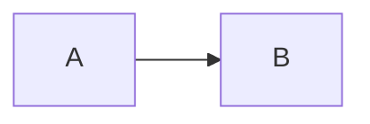

# Auth Diagrams (Mermaid)

Single source of truth for the diagrams referenced in [`../auth-bff-encrypted-cookie.md`](../auth-bff-encrypted-cookie.md).

Each `.mmd` file is a standalone Mermaid source. SVG versions (committed next to them) are what the markdown actually embeds.

| Source `.mmd`                                                          | Rendered                                                                               |
| ---------------------------------------------------------------------- | -------------------------------------------------------------------------------------- |
| [`01-high-level-architecture.mmd`](./01-high-level-architecture.mmd)   | High-level BFF architecture                                                            |
| [`02-provider-registry.mmd`](./02-provider-registry.mmd)               | Multi-provider registry                                                                |
| [`03-login-flow.mmd`](./03-login-flow.mmd)                             | Login (Authorization Code + PKCE)                                                      |
| [`04-api-request-refresh.mmd`](./04-api-request-refresh.mmd)           | Authenticated API request + transparent refresh                                        |
| [`05-logout-flow.mmd`](./05-logout-flow.mmd)                           | Federated logout                                                                       |
| [`06-cross-pod-stateless.mmd`](./06-cross-pod-stateless.mmd)           | Cross-pod stateless decryption                                                         |
| [`07-cookie-structure.mmd`](./07-cookie-structure.mmd)                 | Encrypted cookie payload structure                                                     |
| [`08-toolset-signin-interrupt.mmd`](./08-toolset-signin-interrupt.mmd) | Mid-completion toolset **and application external-service** sign-in via client-channel |

---

## How diagrams render in markdown

Markdown is not a graphics format. Diagrams render only when something else turns them into images. There are three realistic paths; pick **one** and stick with it.

### Option 1 — Pre-rendered SVGs (current setup)

The main doc embeds SVG files with ``. SVGs render **everywhere**: GitHub, GitLab, Bitbucket, any IDE, PDF export, Confluence (after upload), printed pages.

**Edit workflow:**

1. Edit a `.mmd` file.
2. Regenerate SVGs (see [generation](#generating-svgs) below).
3. Commit both the `.mmd` and the resulting `.svg`.

**Pros:** universal rendering, no runtime mermaid dependency, fast page load.
**Cons:** must regenerate after each edit; SVGs add to the repo.

### Option 2 — Inline Mermaid fenced blocks

Markdown can also embed Mermaid as a fenced code block:

````markdown

````

**Renders in:**

- GitHub web UI (native since 2022) — yes.
- GitLab — yes (since 13.3).
- Cursor / VS Code markdown preview — yes, with the `Markdown Preview Mermaid Support` extension (built-in for many setups).
- Confluence, Notion, generic static-site generators — no by default.

**Pros:** zero build step, edit in place.
**Cons:** breaks outside Mermaid-aware viewers; harder to keep `.mmd` and inline copies in sync (we abandoned this trade-off in favour of `.svg` embeds).

### Option 3 — Live preview only

Open any `.mmd` file at <https://mermaid.live> by pasting its content. Useful for ad-hoc review without touching the repo.

---

## Generating SVGs

We use the official Mermaid CLI (`mmdc`). It runs Headless Chrome and produces clean SVGs.

### One-off (recommended)

From the repo root:

```bash
npx -y @mermaid-js/mermaid-cli \
  -i docs/auth-diagrams/01-high-level-architecture.mmd \
  -o docs/auth-diagrams/01-high-level-architecture.svg \
  -b transparent
```

### Render all at once

```bash
cd docs/auth-diagrams
for f in *.mmd; do
  npx -y @mermaid-js/mermaid-cli -i "$f" -o "${f%.mmd}.svg" -b transparent
done
```

### Optional: add an npm script

Add to the workspace `package.json`:

```json
{
  "scripts": {
    "docs:diagrams": "for f in docs/auth-diagrams/*.mmd; do npx -y @mermaid-js/mermaid-cli -i \"$f\" -o \"${f%.mmd}.svg\" -b transparent; done"
  }
}
```

Then:

```bash
npm run docs:diagrams
```

### Optional: Nx target

If we want it tracked by Nx affected/caching, add a `tools` or `docs` project with a target like:

```jsonc
// project.json
{
  "name": "docs",
  "targets": {
    "diagrams": {
      "executor": "nx:run-commands",
      "options": {
        "command": "mmdc -i {args.in} -o {args.out} -b transparent",
      },
      "inputs": ["{projectRoot}/auth-diagrams/*.mmd"],
      "outputs": ["{projectRoot}/auth-diagrams/*.svg"],
    },
  },
}
```

This is overkill for the current size but worth considering if the doc set grows.

---

## Theming

Pass `--theme` (`default`, `dark`, `neutral`, `forest`) or a JSON config:

```bash
npx -y @mermaid-js/mermaid-cli -i diagram.mmd -o diagram.svg --theme dark
```

For consistent project styling, drop a `mermaidrc.json` next to the diagrams and reference it via `-c mermaidrc.json`.

---

## CI integration (optional)

To prevent stale SVGs, add a pre-commit hook or CI check that re-renders all `.mmd` and fails if the working tree differs:

```bash
npm run docs:diagrams
git diff --exit-code docs/auth-diagrams/*.svg
```

Run it from `lint-staged`, a Husky hook, or a workflow step before merge.
