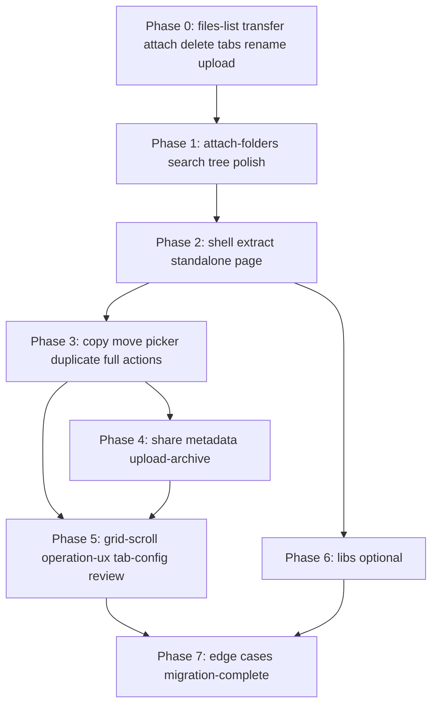

# DIAL File Manager — full gap matrix (legacy `development` vs current)

Living reference comparing **legacy** [`development`](https://github.com/epam/ai-dial-chat/tree/development/apps/chat/src/components/FileManager) with **current** `DialFileManagerModal` + `useDialFileManager`.

Covers three legacy surfaces:

| Surface | Legacy entry | Purpose |
|---------|--------------|---------|
| **Attach modal** | [`FileManagerModal.tsx`](https://github.com/epam/ai-dial-chat/blob/development/apps/chat/src/components/Files/FileManagerModal.tsx) | Pick files/folders for chat attach |
| **Standalone page** | [`FileManager.tsx`](https://github.com/epam/ai-dial-chat/blob/development/apps/chat/src/components/FileManager/FileManager.tsx) | Full file manager route |
| **Folder picker** | [`SelectFolderModal.tsx`](https://github.com/epam/ai-dial-chat/blob/development/apps/chat/src/components/Files/SelectFolderModal.tsx) | Choose destination folder (move/copy) |

| | Legacy | Current |
|---|--------|---------|
| Shared hook | `useFileManager` (~1600 LOC, Redux + legacy `/api/listing`) | `useDialFileManager` (~1260 LOC, BFF `/api/v1/files/*`) |
| UI shell | `DialFileManager` (ui-kit) | same |
| Attach UI | `Modal` + Attach button | `DialPopup` + Attach button |
| Standalone UI | full-page `div` | **not implemented** |

**Legend — Current:** ✅ done · ⚠️ partial · ❌ missing · — N/A (not applicable to surface)

**Last updated:** 2026-06-25 — verified on branch `rename` (includes merged `development-1.0`, tabs #7407, rename #7425).

**Verification baseline:** `git branch` → `rename`; code + `openspec/changes/archive/` audited. Stale duplicate change folders may still exist under `openspec/changes/add-file-manager-{tabs,rename,upload-conflicts}/` — canonical state is in **archive** only; delete duplicates before merge (step **0.7**).

---

## Architecture delta

| Area | Legacy | Current |
|------|--------|---------|
| State | Redux (`FilesActions`, `FilesSelectors`) | Local React state + per-folder `Map` cache |
| Listings | Legacy `/api/listing`, Share/Publication epics | `GET /api/v1/files/list`, `/shared`, `/public`; **BFF exhausts `nextToken` pages** when hook omits `token`/`limit` (`FULL_FILE_LIST_PAGE_LIMIT=1000`) |
| Mutations | Legacy `FileService` → data storage | BFF: `POST upload`, `folders`, `delete`, `rename`, `download-archive` |
| i18n | `useTranslation` + `translateFileManagerChrome` DOM patches | `react-i18next` + `dialFileManager.*` keys |
| Grid editing scroll | [`useGridEditingScroll.ts`](https://github.com/epam/ai-dial-chat/blob/development/apps/chat/src/components/FileManager/hooks/useGridEditingScroll.ts) | ❌ not ported |

---

## Table 3 — Full gap matrix

| # | Feature | Legacy modal | Legacy standalone | Legacy folder picker | Current modal | Current standalone | Priority | Notes / next change |
|---|---------|:------------:|:-----------------:|:--------------------:|:-------------:|:------------------:|:--------:|---------------------|
| **Shell & routing** |
| 1 | Standalone FM page route | — | ✅ | — | — | ❌ | **P2** | New `DialFileManagerPage` + nav entry |
| 2 | Attach modal shell | ✅ | — | — | ✅ | — | — | `DialPopup` vs legacy `Modal` |
| 3 | Folder destination popup (`SelectFolderModal`) | — | — | ✅ | — | ❌ | **P2** | Needs move/copy BFF first |
| 4 | `sourceFilters` / configurable tabs | ✅ | ✅ (fixed set) | ✅ (my/review) | ⚠️ fixed 3 tabs | — | **P2** | Review tab excluded in modal |
| **Tabs & listings** |
| 5 | Tabs: My / Shared / Org | ✅ | ✅ | my only | ✅ | ❌ | — | `useDialFileManager` + toolbar |
| 6 | Tab: Review | ✅ (optional) | ❌ | ✅ (review bucket) | ❌ filtered out | ❌ | **P3** | `reviewBucket` + filter |
| 7 | Three listing sources (bucket / shared / public) | ✅ Redux | ✅ | ✅ | ✅ BFF | ❌ | — | `fetchByTab` in hook |
| 8 | Shared subfolder navigation (`sharedWithMeIds`) | ✅ | ✅ | — | ✅ | ❌ | — | `sharedRootMetaRef` |
| 9 | Tab-specific client filters (`sharedWithMe`, `publishedWithMe`) | ✅ | ✅ | — | ⚠️ server-split only | — | **P2** | Legacy also filtered user-bucket view |
| 10 | List pagination (`nextToken`) | ✅ client cursor | ✅ client cursor | partial | ✅ BFF aggregate | ✅ *(hook)* | — | `FilesService.listFiles` loops pages when no `token`/`limit`; explicit `token`+`limit` still exposed for API clients |
| **Grid & tree UX** |
| 11 | Columns: Name, UpdatedAt, Size, Actions | ✅ | ✅ | folders only | ✅ | ❌ | — | `visibleColumns` |
| 12 | Author column (Shared tab only) | ✅ | ✅ | — | ✅ | ❌ | — | `COLUMNS_WITH_AUTHOR` |
| 13 | `dateLocale` + `dateOptions` (Modified date) | ✅ | ✅ | — | ✅ | ❌ | — | `i18n.language` + fixed options |
| 14 | Tree `expandedPaths` / `loadedPaths` | ✅ | ✅ | partial | ❌ | ❌ | **P1** | Legacy lazy tree |
| 15 | Tree collapse header / default folder name i18n | ✅ | ✅ | ✅ | ❌ | ❌ | **P2** | `treeOptions` |
| 16 | `useGridEditingScroll` (rename/create scroll) | ✅ | ✅ | — | ❌ | ❌ | **P2** | Port hook or equivalent |
| 17 | `translateFileManagerChrome` DOM patches | ✅ | ✅ | — | ❌ | ❌ | **P3** | Replaced by i18n keys where possible |
| 18 | Search (`onSearchFiles`, recursive) | ✅ | ✅ | — | ❌ `searchable: false` | ❌ | **P1** | `navigationPanelOptions` |
| 19 | `hideSearchPathItemName` | ✅ | ✅ | — | ❌ | ❌ | **P2** | With search slice |
| **Attach & selection (modal only)** |
| 20 | `allowedFileTypes` / size / count limits | ✅ | — | — | ✅ | — | — | attach-parity |
| 21 | Hidden paths blocked + tooltip | ✅ | — | — | ✅ | — | — | |
| 22 | Attach header description | ✅ | — | — | ✅ | — | — | |
| 23 | Attach folders (`canAttachFolders`) | ✅ | — | — | ⚠️ | — | **P1** | UI ready; call sites default off |
| 24 | `additionalFilesAndFolders` injection | ✅ | — | — | ❌ | — | **P3** | Edge case |
| 25 | `autoSelectUploadedItems` | ✅ | — | — | ❌ | — | **P1** | Legacy modal prop |
| 26 | Redux selection vs local `selectedPaths` | ✅ | — | — | ✅ local | — | — | Simpler in current |
| **Transfer actions** |
| 27 | Upload files | ✅ | ✅ | ❌ | ✅ | ❌ | — | transfer-actions |
| 28 | Upload progress modal | ✅ [`FilesUploadingModal`](https://github.com/epam/ai-dial-chat/blob/development/apps/chat/src/components/FileManager/FilesUploadingModal.tsx) | ✅ | — | ✅ `UploadProgressModal` | ❌ | — | Legacy parity bar |
| 29 | Create folder | ✅ | ✅ | ✅ | ✅ | ❌ | — | BFF marker strategy |
| 30 | Download file / archive | ✅ | ✅ | — | ✅ | ❌ | — | |
| 31 | Upload archive (ZIP) | — | ✅ toolbar | — | ❌ | ❌ | **P2** | Standalone toolbar action |
| 32 | Upload conflict popup (replace/duplicate) | ✅ | ✅ | — | ✅ | ❌ | — | ui-kit popup via `conflictResolutionPopupOptions`; `onValidateUpload` returns `{ valid: true }` per spec |
| 33 | Filename sanitization on upload | ✅ `prepareFileName` | ✅ | — | ✅ `sanitizeFileName` | ❌ | — | upload-conflicts |
| 34 | `prepareFileName` on upload batch (legacy hook) | ✅ | ✅ | — | ⚠️ sanitize only | — | **P2** | Byte-limit trim not ported |
| **CRUD & metadata** |
| 35 | Delete / bulk delete | ✅ my only | ✅ my only | ✅ my only | ✅ my only | ❌ | — | delete + tab gating |
| 36 | Rename (inline → `moveResource`) | ✅ my | ✅ my | ✅ my | ✅ my | ❌ | — | `POST /api/v1/files/rename` |
| 37 | Copy to folder | — | ✅ | — (picker is target) | ❌ | ❌ | **P2** | `onCopyFiles` + BFF |
| 38 | Move to folder | — | ✅ | ✅ (select) | ❌ | ❌ | **P2** | Hook `onMoveToFiles` is **inline rename only**; cross-folder move needs new BFF + picker |
| 39 | Duplicate | — | ✅ | — | ❌ | ❌ | **P2** | Standalone action |
| 40 | Share / Unshare | — | ✅ | — | ❌ | ❌ | **P2** | Redux + dialogs in legacy |
| 41 | Remove access (bulk, shared-by-me) | — | ✅ | — | ❌ | ❌ | **P2** | `sharedByMePaths` + action |
| 42 | File metadata popup (`onGetInfo`) | — | ✅ | — | ❌ | ❌ | **P2** | BFF `GET metadata` exists |
| 43 | Row click / preview | stub | stub | — | ❌ | ❌ | **P3** | |
| **Actions matrix (per tab)** |
| 44 | **Modal** actions: Delete, Download, Rename | ✅ | — | — | ✅ | — | — | [`FileManagerModal` actionsByTab](https://github.com/epam/ai-dial-chat/blob/development/apps/chat/src/components/Files/FileManagerModal.tsx) |
| 45 | **Standalone** full actions (Copy, Move, Duplicate, Share, Info, …) | — | ✅ | — | — | ❌ | **P2** | [`useFileManagerActionLabels`](https://github.com/epam/ai-dial-chat/blob/development/apps/chat/src/components/FileManager/hooks/useFileManager.tsx) DEFAULT_TAB_ACTIONS |
| 46 | **Folder picker** actions: Rename, Delete | — | — | ✅ | — | ❌ | **P2** | After move/copy |
| 47 | Upload enabled: Org/Review off | ✅ | ✅ | ❌ | ✅ | — | — | |
| 48 | Upload enabled: Shared root off | ✅ | ✅ | — | ✅ | — | — | |
| **UX polish** |
| 49 | `OperationLoaderModal` (copy/move) | ⚠️ hook returns; modal hides when renaming | ✅ | — | ❌ | ❌ | **P1** | Rename uses inline overlay; copy/move modal not ported |
| 50 | Global `isAnyOperationInProgress` overlay | ✅ | ✅ | — | ⚠️ per-op loaders (incl. rename) | ❌ | **P2** | Modal: download/delete/rename/upload separate overlays |
| 51 | Operation blackout blocks Attach | ✅ | — | — | ✅ | — | — | `isOperationInProgress` |
| 52 | Success/error toasts (upload/folder/delete/rename) | ✅ | ✅ | — | ✅ notifications | ❌ | — | |
| 53 | `sharedByMePaths` indicators | — | ✅ | — | ❌ | ❌ | **P2** | Grid/tree badges |
| 54 | Empty state copy per tab | ✅ | ✅ | — | ⚠️ generic props | ❌ | **P2** | Legacy tab-specific empty |
| 55 | `forbiddenSymbolsRegExp` + tooltip | ✅ | ✅ | ✅ | ✅ | ❌ | — | |

---

## Shipped OpenSpec slices (branch `rename`)

All listed changes are **archived** under `openspec/changes/archive/`. Implementation verified in `apps/chat` + `apps/chat-api`.

| Change | Archived | Covers (rows) | Code verified |
|--------|----------|---------------|---------------|
| `add-file-manager-transfer-actions` | `2026-06-19` | 27–30, 28 | ✅ |
| `dial-file-manager-attach-parity` | `2026-06-19` | 20–22, 23 *(UI only)* | ✅ modal; attach E2E → step 2 |
| `add-file-manager-delete` | `2026-06-20` | 35, 44 | ✅ |
| `add-file-manager-upload-conflicts` | `2026-06-22` | 32–33 | ✅ complete (incl. test 2.5) |
| `add-file-manager-tabs` | `2026-06-24` | 5–8, 11–13, 47–48 | ✅ merged #7407 |
| `add-file-manager-rename` | `2026-06-24` | 36, 44, 52 | ✅ on branch `rename` (#7425 merge base + rename commit) |
| `add-files-list-api` | `2026-06-18` | 10 | ✅ BFF auto-aggregate + optional explicit `nextToken` |

---

## Partial implementations (detail)

| Feature | What works | What is missing |
|---------|------------|-----------------|
| **Upload conflicts (#32)** | `conflictResolutionPopupOptions` wired; `uploadMode` overwrite/create-only; `onValidateUpload` sanitizes + `{ valid: true }` per spec | — |
| **Attach folders (#23)** | Modal dedup + `AttachResult.folderPaths`; `isRowSelectable` when prop true | `ConversationRoute` / `ConversationView` do not pass `canAttachFolders`; `useDialFileManagerState.handleAttach` and `handleAttachDialFiles` ignore `folderPaths` |
| **Inline rename (#36)** | `onRenameValidate`, `onMoveToFiles`, `isRenaming` overlay, My tab action | Cross-folder move (#38) not started; do not confuse with rename API |
| **Tabs (#9)** | Separate BFF endpoints per tab | No client-side `publishedWithMe` / `sharedWithMe` filter on user-bucket items (if still returned) |
| **Operations UX (#49–50)** | Inline `DialLoader` overlays per operation | No `OperationLoaderModal`; no unified global blackout on standalone |
| **List pagination (#10)** | BFF `listFiles` / `listSharedFiles` / `listPublicFiles` aggregate all DIAL pages when hook calls without `token`/`limit` | No UI “load more”; optional explicit cursor API for other clients only |
| **Folder picker (#3)** | — | Entire surface; blocked on move/copy API |

---

## What can move to `libs/` (library isolation)

Per `AGENTS.md`: libs must not import `server-api`, routes, i18n, or BFF paths. **Recommended split:**

### ✅ Safe for `libs/*` (pure / ui-kit only)

| Candidate | Contents | Rationale |
|-----------|----------|-----------|
| **`libs/dial-file-manager-path`** (or `libs/file-manager-utils`) | `virtualPathToApiPath`, `resolveOwnerCoords`, tree builder from flat `ListFilesItemDto[]`, `parseNewFolderVirtualPath` | Pure functions; no HTTP |
| **`libs/dial-file-manager-config`** | `DATE_OPTIONS`, `COLUMNS_WITH/WITHOUT_AUTHOR`, `UPLOAD_CONCURRENCY`, tab → column/action matrix **types** | Shared by modal + page |
| **`libs/dial-file-manager-ui`** (optional) | `UploadProgressModal` (props-only labels), `OperationLoaderModal` port (no i18n inside), `DialFileManagerShell` — thin wrapper around `DialFileManager` wiring grid/tree/toolbar props | Accepts labels/callbacks via props; no `@epam/chat-api-client` |

### ⚠️ App edge (`apps/chat`) — keep or inject dependencies

| Piece | Why it stays in app |
|-------|---------------------|
| `useDialFileManager` | Calls `files.api.ts`, `useTranslation`, notifications — **extract only if** refactored to accept a `DialFileManagerApi` interface |
| `DialFileManagerModal` | Attach footer, `ConversationRoute` wiring, deployment limits |
| `files.api.ts` | BFF adapter (correct per architecture) |
| Tab labels, toasts, delete confirm renderers | Host-owned i18n |

### ❌ Do not put in libs

- Generated `@epam/chat-api-client` wrappers
- Redux / conversation attach logic
- `translateFileManagerChrome` DOM mutation (legacy; drop rather than port)

---

## Reuse strategy: modal → standalone page

Goal: **one hook + one shell component**, two hosts.

```
┌─────────────────────────────────────────────────────────────┐
│  apps/chat                                                   │
│  ┌──────────────────┐     ┌──────────────────────────────┐  │
│  │ DialFileManager  │     │ DialFileManagerPage (new)    │  │
│  │ Modal            │     │ route + page chrome          │  │
│  │ · Attach footer  │     │ · no attach footer           │  │
│  │ · variant=attach │     │ · variant=standalone         │  │
│  └────────┬─────────┘     └──────────────┬───────────────┘  │
│           │                                │                  │
│           └────────────┬───────────────────┘                  │
│                        ▼                                      │
│           ┌────────────────────────────┐                      │
│           │ DialFileManagerShell       │  ← libs or apps/chat │
│           │ (grid/tree/toolbar wiring) │                      │
│           └────────────┬───────────────┘                      │
│                        ▼                                      │
│           ┌────────────────────────────┐                      │
│           │ useDialFileManager         │                      │
│           │ options.variant:           │                      │
│           │  'attach' | 'standalone'   │                      │
│           │  | 'folder-picker'         │                      │
│           └────────────┬───────────────┘                      │
│                        ▼                                      │
│           apps/chat/server-api/files.api.ts                  │
└─────────────────────────────────────────────────────────────┘
                        ▼
              @epam/ai-dial-ui-kit DialFileManager
```

### Recommended steps

See [OpenSpec migration roadmap](#openspec-migration-roadmap) for the ordered change list. Summary:

1. **Extract `DialFileManagerShell`** — step **7** in roadmap (after modal P1 browse slices).
2. **Extend `useDialFileManager`** with `variant` / `actionProfile` — same step.
3. **`DialFileManagerPage`** — step **8**.
4. **`SelectFolderModal`** — step **10** (after copy/move BFF).
5. Do not fork legacy `useFileManager` — BFF + `useDialFileManager` only.

---

## Priority backlog

| Priority | Goal | Rows |
|----------|------|------|
| **P1 close** | Search; tree state; `autoSelectUploadedItems`; attach folders E2E | 14, 18, 23, 25 |
| **P2 standalone** | Page route + shell extract; copy/move/duplicate; share; metadata; upload archive; `OperationLoaderModal`; `SelectFolderModal` | 1, 3, 15–16, 31, 37–42, 45–46, 49, 53–54 |
| **P3** | Review tab; grid chrome patches; row preview; `additionalFilesAndFolders` | 6, 17, 24, 43 |

> **Execution order:** see [OpenSpec migration roadmap](#openspec-migration-roadmap) below — one change at a time, archive after each.

---

## OpenSpec migration roadmap

Sequential plan to reach **full parity** with legacy modal + standalone + folder picker. Each step = one OpenSpec change → implement (`openspec-apply`) → verify → **archive** (`openspec-archive`) → update this doc.

**Rules**

- Do not start step N+1 until step N is archived (or explicitly split into a follow-up with rows carried forward).
- Prefer **vertical slices** (BFF + hook + UI + tests) per change.
- After each archive, mark rows ✅ in Table 3 and move the step to [Completed steps](#completed-steps).

### Status legend

| Symbol | Meaning |
|--------|---------|
| ✅ | Implemented and archived |
| 🔄 | OpenSpec exists; implementation or archive pending |
| 📋 | Planned — create with `openspec-propose` |
| ⏭️ | Optional / product decision |

---

### Phase 0 — Foundation (done)

| Step | OpenSpec change | Rows | Surfaces | Status |
|------|-----------------|------|----------|--------|
| 0.0 | `add-files-list-api` | 10 | all surfaces using BFF list | ✅ archived `2026-06-18`; BFF page aggregation |
| 0.1 | `add-file-manager-transfer-actions` | 27–30, 28 | modal (+ base for standalone) | ✅ archived `2026-06-19` |
| 0.2 | `dial-file-manager-attach-parity` | 20–22 | modal | ✅ archived `2026-06-19` |
| 0.3 | `add-file-manager-delete` | 35, 44 | modal, picker, standalone | ✅ archived `2026-06-20` |
| 0.4 | `add-file-manager-tabs` | 5–8, 11–13, 47–48 | modal (+ hook for all) | ✅ archived `2026-06-24` |
| 0.5 | `add-file-manager-rename` | 36, 44, 52 | modal, picker, standalone | ✅ archived `2026-06-24`; code on branch `rename` |
| 0.6 | `add-file-manager-upload-conflicts` | 32–33 | modal, standalone | ✅ archived `2026-06-22`; complete |
| 0.7 | *(housekeeping)* | — | — | ✅ duplicate `openspec/changes/add-file-manager-*` folders removed |

**Phase 0 exit criteria:** attach modal can upload, download, delete, rename on My tab; browse My / Shared / Org with correct columns and dates. **Met on branch `rename`** except attach folders E2E (#23).

---

### Phase 1 — Attach modal parity (close P1 gaps)

| Step | OpenSpec change | Rows | Depends on | Deliverables |
|------|-----------------|------|------------|--------------|
| **1** | `dial-file-manager-attach-folders-e2e` | 23 | 0.2 | Wire `canAttachFolders` from deployment; consume `folderPaths` in attach/send flow; tests |
| **2** | `add-file-manager-search` | 18, 19 | 0.4 | `onSearchFiles` + recursive listing; `navigationPanelOptions.searchable`; `hideSearchPathItemName` on modal |
| **3** | `add-file-manager-tree-state` | 14, 15 | 0.4 | `expandedPaths` / `loadedPaths` / `onExpandedPathsChange`; tree header i18n; lazy subfolder fetch |
| **4** | `add-file-manager-modal-polish` | 25, 54, 34 | 0.4 | `autoSelectUploadedItems`; tab-specific empty states; optional `prepareFileName` byte limits |

**Phase 1 exit criteria:** legacy [`FileManagerModal`](https://github.com/epam/ai-dial-chat/blob/development/apps/chat/src/components/Files/FileManagerModal.tsx) parity for attach + browse; Table 3 modal column ✅ for rows 14–15, 18–19, 23, 25, 32–34, 54.

---

### Phase 2 — Shared shell + standalone page

| Step | OpenSpec change | Rows | Depends on | Deliverables |
|------|-----------------|------|------------|--------------|
| **7** | `extract-dial-file-manager-shell` | — (refactor) | Phase 1 | `DialFileManagerShell` component; `useDialFileManager` gains `variant` + `actionProfile`; modal becomes thin wrapper; no user-visible regression |
| **8** | `add-file-manager-standalone-page` | 1, 45 (partial), 50 (partial) | 7 | Route + nav entry; `DialFileManagerPage`; reuses shell with `variant=standalone`, `actionProfile=modal` actions expanded later in phase 3; global operation overlay |

**Phase 2 exit criteria:** standalone page browses same data as modal (tabs, columns, CRUD already in hook); no attach footer.

---

### Phase 3 — Standalone mutations (copy / move / picker)

| Step | OpenSpec change | Rows | Depends on | Deliverables |
|------|-----------------|------|------------|--------------|
| **9** | `add-file-manager-copy-move` | 37, 38, 49 | 8 | BFF copy + cross-folder move (separate from existing inline-rename `onMoveToFiles`); `onCopyFiles`; [`OperationLoaderModal`](https://github.com/epam/ai-dial-chat/blob/development/apps/chat/src/components/FileManager/OperationLoaderModal.tsx) port; cancel in-flight |
| **10** | `add-file-manager-select-folder-modal` | 3, 46 | 9 | `SelectFolderModal` via `DialDestinationFolderPopup`; `variant=folder-picker`; rename/delete on my_files; used by move/copy flows |
| **11** | `add-file-manager-duplicate` | 39 | 9 | `onDuplicate` / BFF copy-in-same-folder; action labels on standalone `my_files` tab |
| **12** | `add-file-manager-standalone-actions` | 45 | 8–11 | Full `useFileManagerActionLabels` parity per tab (Copy, Move, Duplicate, Download, Delete, Rename, Info, Share, …); wire shell `actionProfile=full` |

**Phase 3 exit criteria:** legacy [`FileManager.tsx`](https://github.com/epam/ai-dial-chat/blob/development/apps/chat/src/components/FileManager/FileManager.tsx) CRUD + clipboard parity except sharing/metadata.

---

### Phase 4 — Sharing, metadata, archive upload

| Step | OpenSpec change | Rows | Depends on | Deliverables |
|------|-----------------|------|------------|--------------|
| **13** | `add-file-manager-sharing` | 40, 41, 53 | 12 | Share/unshare/remove-access UI + BFF or Core proxy; `sharedByMePaths` on grid/tree; bulk Remove access when all selected shared-by-me |
| **14** | `add-file-manager-metadata-ui` | 42 | 12 | `onGetInfo` + `fileMetadataPopupOptions`; wire `GET /api/v1/files/metadata` |
| **15** | `add-file-manager-upload-archive` | 31 | 8 | Toolbar upload archive; BFF extract-if-needed; standalone + modal (optional) |

**Phase 4 exit criteria:** standalone feature-complete vs legacy page for all P2 rows.

---

### Phase 5 — UX polish & configuration

| Step | OpenSpec change | Rows | Depends on | Deliverables |
|------|-----------------|------|------------|--------------|
| **16** | `add-file-manager-grid-editing-scroll` | 16 | 7 | Port [`useGridEditingScroll`](https://github.com/epam/ai-dial-chat/blob/development/apps/chat/src/components/FileManager/hooks/useGridEditingScroll.ts); rename/create folder scroll into view |
| **17** | `add-file-manager-operation-ux` | 50 | 7, 9 | Unified `isAnyOperationInProgress` overlay; align modal + standalone with legacy blackout |
| **18** | `add-file-manager-tab-config` | 4, 9 | 0.4 | `sourceFilters` / deployment-driven `availableTabs`; client-side my-bucket filters for shared/published items |
| **19** | `add-file-manager-review-tab` | 6 | 18 | `reviewBucket`; Review tab in modal + picker; ⏭️ skip if product drops Review |

**Phase 5 exit criteria:** configurability and editor UX match legacy; P3 items except preview/injection decided.

---

### Phase 6 — Library extraction (optional, parallel-safe after step 7)

| Step | OpenSpec change | Rows | Depends on | Deliverables |
|------|-----------------|------|------------|--------------|
| **20** | `extract-dial-file-manager-path-lib` | — | 7 | `libs/dial-file-manager-path` — pure path/tree utils; apps import from lib |
| **21** | `extract-dial-file-manager-ui-lib` | — | 7, 20 | `libs/dial-file-manager-ui` — `UploadProgressModal`, `OperationLoaderModal`, `DialFileManagerShell` (props-only, no i18n) |

Can run **20–21** after step 7 without blocking feature steps; do not block Phase 3 on libs.

---

### Phase 7 — Edge cases & migration complete

| Step | OpenSpec change | Rows | Depends on | Deliverables |
|------|-----------------|------|------------|--------------|
| **22** | `add-file-manager-preview` | 43 | 14 | Row click / preview stub parity — ⏭️ if out of scope |
| **23** | `add-file-manager-additional-items` | 24 | 0.2 | `additionalFilesAndFolders` injection for attach modal — ⏭️ if unused |
| **24** | `dial-file-manager-migration-complete` | all | 1–23 | Final audit vs Table 3; archive any stray active changes; update `docs/`; remove legacy references from internal runbooks |

**Migration complete when:** every row in Table 3 is ✅ or explicitly ⏭️ with PO sign-off; standalone + modal + folder picker surfaces all ✅; no active `openspec/changes/add-file-manager-*` folders remain.

---

### Completed steps

| OpenSpec change | Archived | Rows closed |
|-----------------|----------|-------------|
| `add-files-list-api` | `2026-06-18` | 10 |
| `add-file-manager-transfer-actions` | `2026-06-19` | 27–30, 28 |
| `dial-file-manager-attach-parity` | `2026-06-19` | 20–22 |
| `add-file-manager-delete` | `2026-06-20` | 35, 44 |
| `add-file-manager-upload-conflicts` | `2026-06-22` | 32–33 |
| `add-file-manager-tabs` | `2026-06-24` | 5–8, 11–13, 47–48 |
| `add-file-manager-rename` | `2026-06-24` | 36, 44, 52 |

---

### Dependency graph (summary)



---

### Next action (branch `rename`)

**Step 1** — `dial-file-manager-attach-folders-e2e` (wire `canAttachFolders`, consume `folderPaths` in attach/send).

---

## Legacy file map (investigation index)

| Legacy file | Role |
|-------------|------|
| [`useFileManager.tsx`](https://github.com/epam/ai-dial-chat/blob/development/apps/chat/src/components/FileManager/hooks/useFileManager.tsx) | Monolithic hook: tabs, search, actions, loaders, metadata |
| [`useGridEditingScroll.ts`](https://github.com/epam/ai-dial-chat/blob/development/apps/chat/src/components/FileManager/hooks/useGridEditingScroll.ts) | AG Grid scroll on rename / new folder row |
| [`FileManager.tsx`](https://github.com/epam/ai-dial-chat/blob/development/apps/chat/src/components/FileManager/FileManager.tsx) | Standalone page composition |
| [`FileManagerModal.tsx`](https://github.com/epam/ai-dial-chat/blob/development/apps/chat/src/components/Files/FileManagerModal.tsx) | Attach modal composition |
| [`SelectFolderModal.tsx`](https://github.com/epam/ai-dial-chat/blob/development/apps/chat/src/components/Files/SelectFolderModal.tsx) | Destination folder picker |
| [`FilesUploadingModal.tsx`](https://github.com/epam/ai-dial-chat/blob/development/apps/chat/src/components/FileManager/FilesUploadingModal.tsx) | Upload progress UI reference |
| [`OperationLoaderModal.tsx`](https://github.com/epam/ai-dial-chat/blob/development/apps/chat/src/components/FileManager/OperationLoaderModal.tsx) | Copy/move spinner popup |

## Current file map

| Current file | Role |
|--------------|------|
| `apps/chat/src/hooks/files/useDialFileManager.ts` | BFF-backed hook (tabs, CRUD, upload) |
| `apps/chat/src/components/DialFileManagerModal/DialFileManagerModal.tsx` | Attach modal |
| `apps/chat/src/components/DialFileManagerModal/UploadProgressModal.tsx` | Upload progress |
| `apps/chat/src/server-api/files.api.ts` | BFF client adapter |
| `apps/chat-api/src/files/*` | BFF implementation |

---

## Changelog

| Date | Change |
|------|--------|
| Initial | Modal-only matrix |
| 2026-06-24 | Full matrix: modal + standalone + folder picker; libs/reuse section; reflects tabs, rename, shared/public BFF |
| 2026-06-24 | Added OpenSpec migration roadmap (Phases 0–7, steps 0.1–24) |
| 2026-06-25 | Re-verified on branch `rename`: archive dates, rename shipped, stale OpenSpec dupes, attach-folders gap, inline vs cross-folder move |
| 2026-06-25 | Row #10 ✅: BFF-backed list pagination (auto-aggregate pages); removed `add-file-manager-list-pagination` from roadmap |
| 2026-06-25 | Step 0.7 done (removed duplicate OpenSpec folders); row #32 ✅; upload-conflicts test 2.5 |
