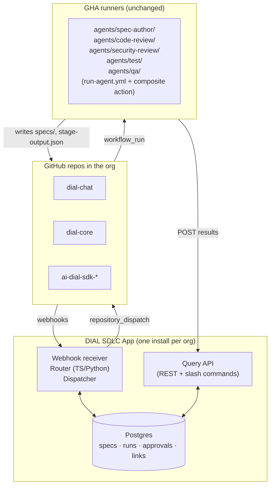

# Phase 2 Design: SDLC Orchestrator as a GitHub App

Companion to [`orchestration-research.md`](./orchestration-research.md)
(vision, architecture, and pivot triggers).

The research doc identifies this as **Phase 2 / Option B**. This document
sketches what it concretely looks like, what it would cost, and the order
in which it should be built when the triggers fire. It deliberately
does *not* recommend building it today.

---

## Table of Contents

- [Summary](#summary)
- [When to Build This](#when-to-build-this)
- [Architecture](#architecture)
- [What the App Owns vs. What Stays in GHA](#what-the-app-owns-vs-what-stays-in-gha)
- [Data Model](#data-model)
- [End-to-End Flows](#end-to-end-flows)
- [What Survives the Migration Unchanged](#what-survives-the-migration-unchanged)
- [Operational Footprint](#operational-footprint)
- [Build Order](#build-order)
- [Open Questions](#open-questions)

---

## Summary

A single GitHub App, installed once per organization, replaces the YAML
dispatcher (`dispatch-pr.yml` + `run-agent.yml` + `.github/claude/scripts/match-agents.py`)
as the routing and state layer. GHA stays as the **execution** layer —
the reusable per-agent workflow and agent manifests under `agents/` are
unchanged. The App holds spec lifecycle, stage run
history, approvals, and cross-repo coordination in Postgres and dispatches
stages via `repository_dispatch`.

The single most important property: **everything built in Phase 1
(stages, composite action, prompts, schema) survives this migration
intact.** The App replaces routing, not execution.

---

## When to Build This

From the research doc's pivot triggers. Build when *any* of these become
true:

- A second event source needs cross-PR state ("has anything in `specs/`
  changed since this PR opened?")
- Routing logic requires more than two `if:` clauses or any non-trivial
  JSON traversal in YAML
- Human approval records must be queried as audit artifacts (not just
  present in logs)
- Severity-based escalation ("high → human, medium → comment, low →
  suppress") becomes a real requirement
- A second repository wants to use the same orchestration
- Cross-repo coordination ("dial-chat PR requires a dial-core PR")
  appears as a real flow

The current footprint (two stages, single repo, label-less PR triggers)
hits none of these.

### Phase 1.5 — artifacts before the App

Between Phase 1 (today) and Phase 2 (this doc) there's a cheap intermediate
step: the composite action uploads every stage's `stage-output.json` as a
workflow artifact (90-day retention). This unlocks **cross-run state
within a single repo** without standing up any service:

- Compare this commit's findings to the previous commit's on the same PR
- 90-day audit trail of every stage's full JSON output
- Manual debugging of historical runs without log scraping

Phase 1.5 covers everything the App does *except* cross-repo coordination,
approval records, and cross-PR queries. If the pressing need is "I want
to know if this commit introduced a new high-severity finding", artifacts
are sufficient. The pivot to the App should only happen when the bullets
in the previous section appear — Phase 1.5 buys time, not features the
App uniquely provides.

See `.github/claude/PLATFORM_REFERENCE.md` → *Cross-run state* for the
consumption pattern.

---

## Architecture



---

## What the App Owns vs. What Stays in GHA

| Concern | Phase 1 (today) | Phase 2 (App) |
|---|---|---|
| Triggers (PR events, issues, comments) | Workflow `on:` blocks | App webhook receiver |
| Routing decisions | `if:` expressions in YAML | TypeScript/Python in the App |
| Dispatching stages | `uses: ./stage-X.yml` via orchestrator | App calls `POST /repos/.../dispatches` |
| Stage execution | Reusable workflow + composite action | **Unchanged** |
| Prompts, schema, sticky JSON contract | `.github/claude/` | **Unchanged** |
| Spec lifecycle | None (or git-only) | Postgres: state, version, approvals |
| Cross-stage state | Same-run `needs.X.outputs.Y` | Same-run still works; cross-run reads App API |
| Cross-repo coordination | Not supported | First-class via `changes` table |
| Human approvals | GHA `environment:` (logs only) | Real audit rows: who, when, what version |
| Cross-PR / cross-time queries | Log scraping | App query API |

The App **adds** capabilities; it does not replace stage workflows.

---

## Data Model

Five tables. Postgres or DynamoDB — nothing exotic.

```
specs
  id              -- "issue-4521" (org-wide unique)
  issue_repo      -- "org/dial-chat"
  issue_number    -- 4521
  state           -- draft | needs_revision | ready | approved | superseded
  version         -- 1, 2, 3 ...
  body_hash       -- SHA of SPEC.md content
  approved_by     -- GitHub user id, nullable
  approved_at     -- timestamp, nullable

changes
  id              -- "change-4521"
  spec_id         -- FK -> specs.id
  state           -- open | gated | approved | shipped
  required_repos  -- ["org/dial-chat", "org/dial-core"]

change_prs        -- the cross-repo glue
  change_id       -- FK -> changes.id
  repo            -- "org/dial-core"
  pr_number       -- 312

stage_runs
  id
  change_id       -- FK, nullable for non-SDLC stages
  repo
  pr_number
  stage_name      -- "code-review"
  workflow_run_id
  status          -- passed | passed_with_findings | failed
  spec_version    -- which version this ran against
  payload         -- stage's JSON output
  created_at

approvals
  id
  change_id
  approver        -- GitHub user
  spec_version    -- which version was approved
  scope           -- "spec" | "pr"
  approved_at
```

`spec_version` columns are the staleness mechanism: when a spec moves to
version 2, prior `stage_runs` and `approvals` are obviously stale and the
App can require re-runs / re-approval.

---

## End-to-End Flows

### Single-repo flow (behaviorally identical to today)

1. User opens PR in `dial-chat` → GitHub sends `pull_request.opened`
   webhook to the App.
2. App decides which stages apply (no label scraping; routing is in code).
3. App calls `POST /repos/org/dial-chat/dispatches` with
   `event_type=run-stage` and `client_payload={stage, pr, change_id?}`.
4. A thin GHA workflow (now triggered by `repository_dispatch` instead of
   `pull_request`) calls `run-agent.yml` with `agent_name=code-review`.
5. Stage runs Claude, writes `stage-output.json`, posts sticky comment.
6. Composite action's last step POSTs the JSON +
   `workflow_run_id` to `app/api/stage-runs`.
7. App stores it, computes aggregate status, decides next dispatch.

User-visible behavior is unchanged. The orchestration just lives elsewhere.

### Cross-repo flow (the case GHA can't handle today)

Scenario: feature in `dial-chat` requires a coordinated backend change in
`dial-core`.

1. Engineer opens issue #4521 in `dial-chat` with label
   `change:cross-repo`.
2. App creates `change-4521`, dispatches `stage-spec-author.yml` in
   `dial-chat`.
3. Spec author writes `specs/change-4521/SPEC.md` to a branch. App records
   `spec version 1`.
4. Spec-verify runs; if must-fix, App marks `state=needs_revision`.
   Loop until clean.
5. App posts on the issue: "Spec ready for approval." Tech lead replies
   `/sdlc approve spec`.
6. App writes to `approvals` (`scope=spec, version=1`), marks
   `state=approved`.
7. App creates **two** draft PRs simultaneously: one in `dial-chat`, one
   in `dial-core`, both carrying `change_id=change-4521`. Each PR gets a
   sticky comment with the linked PR.
8. Developers push commits in both repos. Each push triggers verification
   stages **in that repo**.
9. App aggregates `stage_runs` by `change_id`. Sticky comment on each PR
   shows the full cross-repo status: "dial-chat: code-review ok,
   security pending; dial-core: code-review ok, security ok".
10. When all stages on both PRs pass, App posts an approval-ready notice.
    Tech lead replies `/sdlc approve pr`.
11. App auto-merges both PRs in declared order (core first, then chat).

Steps 7, 9, and 11 are structurally impossible in GHA-only — they require
state that spans repos and tokens that act across them. A single
GitHub App installation has both.

---

## What Survives the Migration Unchanged

A non-exhaustive list of artifacts that move *without modification* from
Phase 1 to Phase 2:

- `.github/workflows/stage-*.yml` — reusable workflows
- `.github/actions/run-claude-stage/action.yml` — composite action
- `.github/claude/prompts/*.md` — per-stage prompts
- `.github/claude/schemas/stage-message.schema.json` — output contract
- `.github/claude/scripts/render-stage-comment.py` — output validator + comment renderer
- The manifest-driven agent conventions documented in
  `.github/claude/ADDING_AN_AGENT.md`

What is replaced or modified:

- `.github/workflows/dispatch-pr.yml` and `.github/claude/scripts/match-agents.py` — their
  routing role moves into the App; what remains in GHA is a thin trigger
  that listens for `repository_dispatch` and calls `run-agent.yml`
- Composite action gains one new step: `POST` results to the App's API
  endpoint after writing the sticky comment

---

## Operational Footprint

| Component | Form factor | Burden |
|---|---|---|
| App service | One TypeScript or Python service, Probot-style | Deploy + monitor one service |
| Persistence | Managed Postgres (RDS / Cloud SQL / Supabase) | Standard managed DB |
| Optional UI | Next.js dashboard, or skip and use GitHub as UI | 0 to medium |
| GitHub App registration | One in the org's GitHub settings | One-time setup |
| Webhook ingress | App needs a public URL (or AWS Lambda + API Gateway) | Modest |

This is small. Probot has been the standard template for ~8 years; the
path is well-trodden. Realistic stand-up effort: **2–3 months for a
1–2-person team to reach feature parity with Phase 1 plus the cross-repo
flow above.**

Hosting options to evaluate:

- DIAL infrastructure (matches the Phase 3 roadmap if it's real)
- AWS Lambda + RDS Postgres + API Gateway
- Cloud Run + Cloud SQL
- Render / Fly.io for low-volume deployments

---

## Build Order

In strict order. Each step is independently shippable and leaves the
system in a working state.

1. **App scaffolding.** Probot or octokit. Webhook receiver only — no DB
   yet. Just log every event you'd care about. Verify you receive
   webhooks from every installed repo and that auth works.
2. **Postgres + `specs` and `stage_runs` tables.** Persist what's already
   happening. No new behavior. Build the query API for these two
   tables.
3. **Replace orchestrator with App dispatch.** Stages stop reading PR
   labels; App decides what to dispatch via `repository_dispatch`.
   Behaviorally identical to today, just routed through the App.
   *Validates the migration without adding scope.*
4. **`changes` and cross-repo linking.** First real cross-repo feature.
   Add the `changes` and `change_prs` tables. Implement cross-repo PR
   creation and aggregate sticky comments.
5. **Approval records via comment commands.** `/sdlc approve spec` and
   `/sdlc approve pr`. Write to `approvals`. Replace any remaining
   GHA `environment:` gates.
6. **Query API + optional thin UI.** Most teams use the App's sticky
   comments as the UI and skip the dashboard. Build the UI only when
   sticky comments stop being enough.

Steps 1–3 add the App without changing what the system *does*. Steps 4–6
unlock the features that justify it.

---

## Open Questions

These should be resolved before Step 1 begins. None of them block Phase 1.

1. **Hosting target.** DIAL infra (if real) vs. AWS vs. GCP vs.
   managed (Render/Fly). Affects auth model, secrets management, and
   compliance scope.
2. **Auth for the query API.** GitHub OAuth so reviewers use their
   GitHub identity? Internal SSO? Open to org members only?
3. **Spec storage canonical location.** App DB only, git only, or both
   (git as source of truth, DB as cache and index)? Doc currently
   assumes both; needs a clear contract.
4. **Multi-tenancy scope.** Will this App eventually serve more than the
   DIAL org? If yes, build with per-installation isolation from day one;
   if no, defer.
5. **Failure semantics.** If a stage dispatch fails (GitHub API outage),
   does the App retry, alert, or block the flow? Retry semantics need
   a design decision before Step 3.
6. **Slash-command surface.** `/sdlc approve …` is the obvious one;
   what else (`/sdlc skip <stage>`, `/sdlc rerun <stage>`,
   `/sdlc status`)? Affects the parser and the doc.
7. **Audit retention.** How long are `stage_runs`, `approvals`, `specs`
   retained? Affects DB sizing and compliance posture.

---

## What This Document Does Not Argue

- **That we should build this now.** Phase 1 still fits the current
  footprint. This document exists so the migration is pre-thought, not
  pre-built.
- **That Temporal / Inngest / Restate are wrong choices.** They become
  the right call when the App grows into something with retries,
  signals, queries, and durable execution. The decision point is
  documented in the research doc (Decision Triggers for Pivoting,
  B → C section). The App is the right intermediate step for a
  GitHub-native team.
- **That all stages must move at once.** Step 3 in the build order is
  specifically designed to let you flip stages over to App-dispatch
  incrementally, one at a time, with a rollback path.