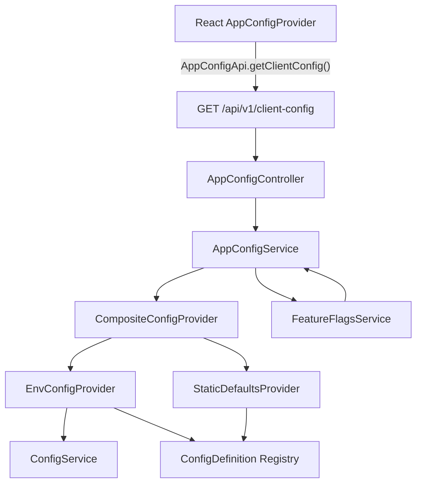
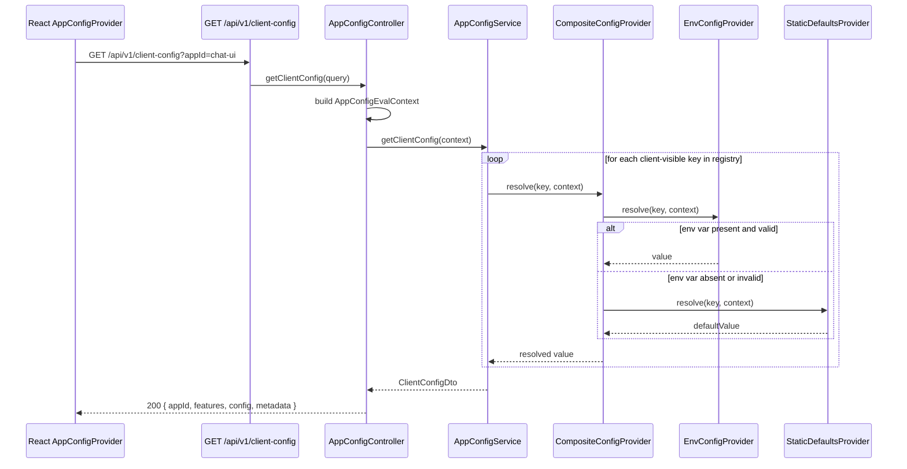
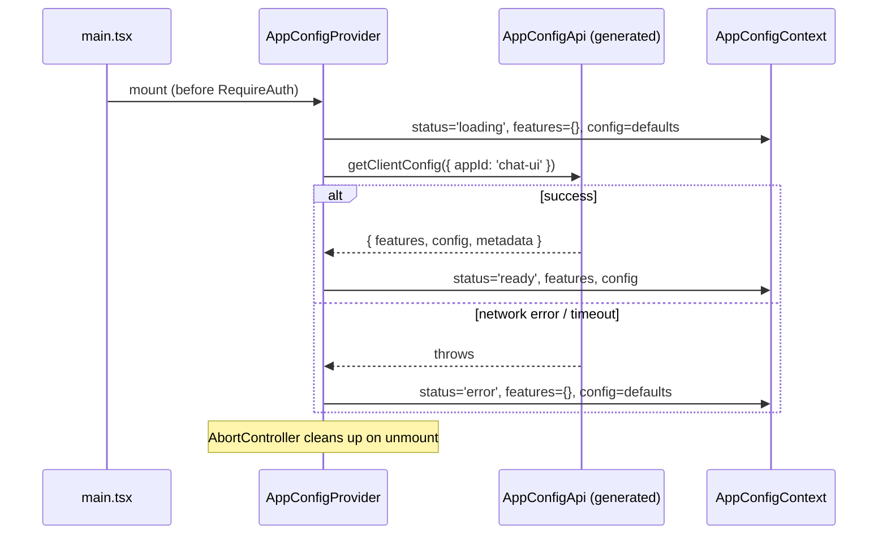

## Context

The backend currently exposes `GET /api/v1/config` via `AppConfigController`, which reads `ASR_MODEL` and `TRANSCRIBE_SIZE_LIMIT_BYTES` directly from `ConfigService` and returns them as a flat DTO. The frontend calls this via the hand-rolled `base.ts` `get()` helper rather than the generated API client. There is no feature flag concept, no visibility separation, no provider chain, and no mechanism for backend services or guards to evaluate runtime configuration.

References to `ENABLED_FEATURES` and `ENABLED_FEATURES_ROLES` exist only as OpenSpec proposal documentation strings — no runtime implementation exists anywhere in the codebase. This change defines the first actual runtime mechanism.

**Current files relevant to this change:**
- `apps/chat-api/src/app-config/app-config.controller.ts` — slim controller, no service layer
- `apps/chat-api/src/app-config/dto/app-config.dto.ts` — two-field DTO
- `apps/chat-api/src/app-config/app-config.module.ts` — no providers, just the controller
- `apps/chat-api/src/config/environment.config.ts` — `EnvironmentVariables` class-validator schema
- `apps/chat/src/context/AppConfigContext.tsx` — `AppConfig` context, no feature flags, Promise chain
- `apps/chat/src/server-api/config.api.ts` — raw `get()` call, not generated client

## Goals / Non-Goals

**Goals:**
- Declarative registry of all known config keys with type, visibility, default, and env-var binding.
- Extensible provider chain (`EnvConfigProvider` → `StaticDefaultsProvider`) with clear extension points for future managed-config and OpenFeature adapters.
- Single `AppConfigService` serving both the backend endpoint and `FeatureFlagsService`.
- `GET /api/v1/client-config?appId=chat-ui` with Swagger/OpenAPI, rate limiting, caching, and integration tests.
- Updated `AppConfigContext` with `useFeatureFlag(key)`, loading/error/ready state, async/await, AbortController, and generated-client integration.
- Typed `AppConfigEvalContext` carrying `appId`, optional `userId`, `roles`, and `environment`.
- Migration of `ASR_MODEL` and `TRANSCRIBE_SIZE_LIMIT_BYTES` without renaming env vars or breaking the feature they power.

**Non-Goals:**
- External provider integration (Unleash, LaunchDarkly, ConfigCat, OpenFeature SDK with a real provider).
- Configuration management UI.
- Percentage rollouts, A/B testing, or user targeting.
- Multi-tenant or workspace-level flag overrides.
- Config for `mindmap-ui`, `admin-ui`, or `rageval-ui`.
- Redis or distributed caching.
- `@RequireFeature` decorator implemented as a full method decorator (thin wrapper only, no AOP).

## Decisions

### D1 — Replace `GET /api/v1/config` with `GET /api/v1/client-config`

**Decision:** Remove the existing endpoint and introduce a new one in the same PR. Update the single frontend caller atomically.

**Rationale:** The flat `{ asrModelId, transcribeSizeLimitBytes }` response shape cannot accommodate `features`/`config` segregation, `metadata`, or `appId` scoping without a breaking change anyway. Introducing a parallel endpoint under the same domain creates confusion. Since there is exactly one caller (`config.api.ts`), the migration cost is a one-file update.

**Alternative rejected:** Extending `GET /api/v1/config` with optional query params — produces an inconsistent response shape and keeps the hand-rolled `base.ts` caller in place.

---

### D2 — Declarative registry as the single source of truth for known keys

**Decision:** A `CONFIG_DEFINITIONS` constant array (or map) in `apps/chat-api/src/app-config/config-registry/` defines every known key, its type, visibility, and env-var binding. `EnvConfigProvider` resolves values by reading from `ConfigService<EnvironmentVariables>` using the per-definition mapping. Unknown keys are rejected at the endpoint; missing values fall through to `StaticDefaultsProvider`.

**Rationale:** Prevents accidental exposure of arbitrary env vars, gives type safety, makes the full key inventory discoverable in one place, and enables future tooling (config docs generation, expiry tracking).

**Data model for a definition:**
```typescript
interface ConfigDefinition<T extends ConfigValueType> {
  key: string;          // e.g. 'asr.modelId'
  type: 'feature' | 'config';
  valueType: 'boolean' | 'string' | 'number' | 'json';
  visibility: 'client' | 'server';
  defaultValue: T;
  critical: boolean;    // true → fail closed (default false) on resolution error
  description: string;
  owner: string;
  envVar?: keyof EnvironmentVariables;
  expiresAt?: string;   // ISO date for cleanup tracking
}
```

**Env-var approach selected:** Option 1 — one typed env var per known key, mapped via `envVar` field in the registry. This integrates cleanly with the existing `class-validator` `EnvironmentVariables` schema, preserves Kubernetes/Helm per-variable ergonomics, and avoids parsing a JSON blob at runtime.

**Option 2 (single JSON env var) rejected** as primary mechanism: hard to set in Helm values files, no per-variable validation, confusing for operators who are used to the existing pattern. May be added later as an override layer.

---

### D3 — `CompositeConfigProvider` with a typed provider interface

**Decision:** Define a `ConfigProvider` interface and a `CompositeConfigProvider` that iterates an injected array of providers in priority order.

```typescript
interface ConfigProvider {
  resolve<T>(key: string, context: AppConfigEvalContext): Promise<T | undefined>;
}
```

Priority order (index 0 = highest):
1. `EnvConfigProvider` — reads from `EnvironmentVariables` via `ConfigService`
2. *(future)* `ManagedConfigProvider` — dial-admin or compatible API
3. *(future)* `OpenFeatureProviderAdapter` — targeting, rollout, experiments
4. `StaticDefaultsProvider` — returns `definition.defaultValue`
5. Caller-supplied default (passed at call site, not a provider)

Future providers are extension points — no stub implementations added.

**Rationale:** The array injection pattern is idiomatic NestJS (inject an `PROVIDERS` token), keeps each provider independently testable, and makes the priority explicit.

---

### D4 — `AppConfigService` as the unified backend resolution surface

**Decision:** `AppConfigService` owns three responsibilities:
1. `resolveValue(key, context)` — low-level resolution through `CompositeConfigProvider` with logging and error handling.
2. `getClientConfig(context)` — filters to `visibility=client` keys and builds the response DTO.
3. `isEnabled(key, context)` — used by `FeatureFlagsService` for boolean-type feature keys.

`FeatureFlagsService` is a thin wrapper that delegates to `AppConfigService.isEnabled` and enforces that only `type=feature` keys are accepted.

**Rationale:** A single resolution path means no divergence between what the endpoint returns and what guards evaluate. Guards reading a different provider would be a security anti-pattern.

---

### D5 — `AppConfigEvalContext` — what context is passed to providers

**Decision:**
```typescript
interface AppConfigEvalContext {
  appId: string;                  // required — 'chat-ui' in first slice
  userId?: string;                // present when user is authenticated
  roles?: string[];               // from session; not returned to client
  environment?: string;           // NODE_ENV or deployment label
}
```

Context is built in the controller from the request (userId/roles from the auth session). In the first slice only `appId` and `environment` matter — `EnvConfigProvider` ignores user-specific fields. Context fields must never be serialized into the client response.

---

### D6 — `AppConfigProvider` moves before `RequireAuth` in `main.tsx`

**Decision:** The provider wraps the router at the app root, not inside `RequireAuth`. Config loading shows a skeleton/null fallback via the `ready` state. Feature flags default to `false` while loading.

**Rationale:** Allows showing a loading state and using feature flags in auth-flow UI (login page, error boundaries). The current placement inside `RequireAuth` means no config is loaded until after authentication, which is awkward for any future pre-auth feature gate.

**Security implication:** The endpoint is public (no auth required — see D7). The `appId=chat-ui` selector is a routing hint, not a security boundary.

---

### D7 — `GET /api/v1/client-config` is unauthenticated

**Decision:** The endpoint requires no session cookie. It returns only `visibility=client` values, which by definition contain no secrets or user-specific data.

**Rationale:** Needed for pre-auth bootstrap. The restricted public contract: no user context is accepted or returned; `appId` is validated against an allowlist of known app IDs.

**Rate limiting:** `@Throttle({ default: { limit: 60, ttl: 60_000 } })` (60 req/min per IP — tighter than the global 100/min default for public endpoints).

---

### D8 — Caching policy

**Decision:** Use `@nestjs/cache-manager` (in-memory). Cache key: `app-config:client:{appId}:user:{userId|anonymous}:roles:{sortedRoles|none}`. TTL: 60 seconds. `EnvConfigProvider` values are static (env vars do not change at runtime), so the TTL is generous; future managed providers will need shorter TTLs or cache invalidation hooks.

The cache includes user identity and sorted roles because `ASR_ENABLED_ROLES` can produce different client config for different callers. Anonymous callers use stable `anonymous` / `none` segments. Future targeting dimensions MUST also be added to the cache key before they affect evaluation.

---

### D9 — Error/failure behavior for critical vs. non-critical flags

| Scenario | Non-critical | Critical (`critical: true`) |
|---|---|---|
| Provider returns `undefined` | Fall through to next provider → static default | Fall through; if all providers miss, return `defaultValue` (usually `false`) |
| Provider throws | Log warning, skip provider, continue chain | Log error, return `false` explicitly (fail closed) |
| Type mismatch (env var not parseable) | Log warning, use static default | Log error, return `false` |
| All providers miss and no `defaultValue` | TypeScript prevents this (required field in registry) | — |

The endpoint MUST NOT return a 500 due to a resolution failure. All errors are swallowed internally; the response always contains safe defaults.

---

### D10 — Endpoint API contract

**Request:**
```
GET /api/v1/client-config?appId=chat-ui
Authorization: (not required)
```

**Query DTO:**
```typescript
class GetClientConfigDto {
  @IsString()
  @IsIn(['chat-ui'])                      // allowlist — extend as new apps are onboarded
  @ApiProperty({ example: 'chat-ui' })
  appId!: string;
}
```

**Response (200):**
```json
{
  "appId": "chat-ui",
  "features": {
    "asrEnabled": false
  },
  "config": {
    "asrModelId": "whisper",
    "transcribeSizeLimitBytes": 5242880
  },
  "metadata": {
    "resolvedAt": "2026-06-22T10:00:00.000Z",
    "cacheTtlSeconds": 60
  }
}
```

**HTTP responses:**
- `200 OK` — resolved config (always, even if all providers failed — safe defaults returned).
- `400 Bad Request` — missing or invalid `appId` (ValidationPipe).
- `429 Too Many Requests` — rate limit exceeded (ThrottlerGuard).

**operationId:** `getClientConfig` (handler method name).

**Response must NOT contain:** server-only values, env var names, provider credentials, user IDs, roles, tenant identifiers, secrets, or internal rollout metadata.

---

### D11 — Frontend `AppConfigContext` redesign

Current context shape:
```typescript
interface AppConfig { asrModelId: string | null; transcribeSizeLimitBytes: number; }
```

New context shape:
```typescript
interface AppConfigState {
  status: 'loading' | 'ready' | 'error';
  features: Record<string, boolean>;
  config: {
    asrModelId: string | null;
    transcribeSizeLimitBytes: number;
  };
  metadata?: { resolvedAt: string; cacheTtlSeconds: number };
}
```

Hooks:
- `useAppConfig(): AppConfigState` — throws `Error` if used outside provider.
- `useFeatureFlag(key: string): boolean` — returns `false` while loading or on error.

Pattern follows `ThemeContext.tsx`: `createContext<AppConfigState | undefined>(undefined)`, `useMemo` on context value, guard hook throws.

Uses `async`/`await` with `AbortController` inside `useEffect` — follows `useFavicon.ts` pattern. Uses `AppConfigApi.getClientConfig({ appId: 'chat-ui' })` from the generated client via `apps/chat/src/server-api/app-config.api.ts`.

---

## Component Diagram



---

## Backend Resolution Sequence



---

## React Bootstrap Sequence



---

## Security Model

- The endpoint is public (no auth required). `visibility=client` definitions must never contain secrets or user-specific data.
- `appId` is validated against an allowlist (`IsIn(['chat-ui'])`). Expanding to new apps requires a code change (deliberate gate).
- Logs must not contain config values, only resolution outcomes (hit/miss/error per provider, key name only).
- No provider credentials or env var names appear in the response.
- Critical flags fail closed (`false`) — they must never leak a server-side value to an unauthorized caller.

## Observability

- `MetricsInterceptor` (already global) captures endpoint latency and status codes automatically.
- `AppConfigService` logs at `debug` level for each key resolved (key name + provider that resolved it + value type only — never the value itself).
- Log at `warn` for provider skip (non-critical error), `error` for critical flag failure.
- Future: add metrics counters for provider hits/misses/errors per key — deferred to avoid high-cardinality labels in the first slice.

## Risks / Trade-offs

- **In-memory cache not shared across replicas** → multiple pod deployments resolve independently. Acceptable for env-var-only first slice (all pods have the same env). Risk materializes only when managed providers with per-request writes are added.  
  *Mitigation:* Document explicitly; add Redis/distributed cache when managed providers are introduced.

- **`appId` allowlist is a code-change gate** → onboarding a new app requires a PR.  
  *Mitigation:* Acceptable in the first slice; can be made configuration-driven later.

- **Moving `AppConfigProvider` before `RequireAuth`** → config loads before the user is authenticated; the endpoint is public; if the endpoint is slow it delays the loading skeleton.  
  *Mitigation:* Endpoint is in-memory-cached and fast. Loading state renders `null` / skeleton, not a broken UI.

- **`useAppConfig()` shape change** → `asrModelId` and `transcribeSizeLimitBytes` move inside `config`.  
  *Mitigation:* All callers in `apps/chat` are updated in the same PR. No external consumers.

## Migration Plan

1. Add registry, providers, `AppConfigService`, `FeatureFlagsService` — no endpoint change yet.
2. Add `GET /api/v1/client-config` alongside the old `GET /api/v1/config`.
3. Run `npm run openapi && npm run openapi:check` — regenerate `@epam/chat-api-client`.
4. Update `apps/chat/src/server-api/app-config.api.ts` to use generated `AppConfigApi`.
5. Update `AppConfigContext.tsx` to use new shape and new server-api wrapper.
6. Update all callers of `useAppConfig()` in `apps/chat`.
7. Remove old `GET /api/v1/config` handler and `config.api.ts`.
8. Verify with `npm exec nx affected --target=test,lint,build --base=origin/development-1.0`.

**Rollback:** Revert the PR. No database state, no external system changes.

## Open Questions

1. **Should `asrEnabled` be a first-class `feature` key or derived from `asrModelId !== null`?** The ASR feature is currently implicit (null model = disabled). Making it explicit in the registry is cleaner but changes how callers check it. Recommend: introduce `features.asrEnabled` computed from `ASR_MODEL` in `EnvConfigProvider`; deprecate null-check pattern.

2. **Should the `roles` field in `AppConfigEvalContext` come from the session claims or a separate RBAC call?** In the first slice roles are not used — deferring to when the first role-gated flag is introduced.

3. **Cache TTL of 60 s — should it be configurable via env var?** Probably yes for operator convenience (e.g. `APP_CONFIG_CACHE_TTL_MS`). Leaving as a constant for the first slice.

4. **`IsIn(['chat-ui'])` hardcoded allowlist — where does the list live?** Options: (a) constant in the DTO, (b) `EnvironmentVariables` field listing allowed app IDs, (c) derived from the registry (which app IDs have registered keys). Recommend option (a) for simplicity in slice 1.

5. **`expiresAt` field in `ConfigDefinition` — who enforces cleanup?** No automated enforcement in this slice. It is a documentation-only annotation. A future linting rule or CI check could warn on expired entries.
