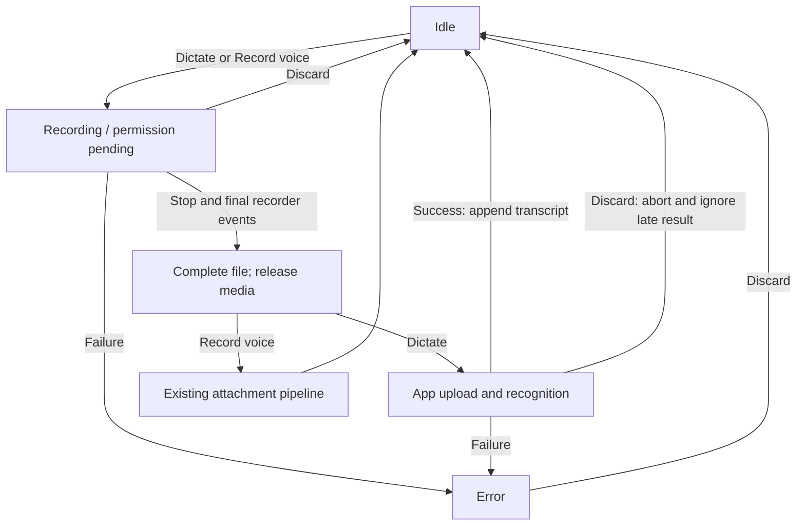

## Context

This change documents the implemented working-tree result: complete-recording dictation and a separate audio attachment action. The existing recorder, attachment pipeline, app configuration and transcription endpoint are reused. Prior fragment recognition was abandoned following practical user feedback about model/Core latency and quality.

The authoritative deltas are [voice-recording-ui](specs/voice-recording-ui/spec.md) and [voice-transcription](specs/voice-transcription/spec.md); [voice-dictation](specs/voice-dictation/spec.md) covers session orchestration. Existing baseline specifications remain unchanged until OpenSpec archive applies these deltas.

## Goals / Non-Goals

**Goals:** Distinct Record voice and Dictate actions, complete files, preserved drafts, no keyboard text entry during capture/processing, cancellable recognition, and parity across new conversation, existing conversation and app preview.

**Non-Goals:** Speech streaming, fragment queues, a new provider or global context, automatic sending, a hardcoded model, guaranteed language/latency, and MCP Apps changes.

## Decisions

### One recorder with a mode fixed at start

`useVoiceRecorder` owns the media stream, AudioContext, MediaRecorder, collected blobs, cancellation controller and lifecycle state. `VoiceRecordingMode.Dictation` selects the host transcription callback; `Attachment` bypasses it. The callback/provider is captured at start, while transcript delivery uses the latest draft callback.

One recorder runs through pauses until Stop. It collects all blobs and retains the actual MIME type, avoiding incomplete audio containers. Only dictation skips zero-size, sub-100 ms or sampled silent recordings; attachment recording retains normal file delivery. Media resources are released after final recorder events and before recognition is awaited. Duplicate Stop events do not duplicate delivery.

Whole-file recognition gives the configured model full context and reduces request frequency. Fragment queues were rejected after user testing; native/browser realtime recognition would introduce another provider contract. A second independent recorder hook was unnecessary because both modes share capture and cleanup.

### State and draft ownership

`useMessageState` keeps text while the textarea is unmounted. Input owns appending a nonempty trimmed transcript to the latest draft with a separating space only when needed, notifying `onChange`, and restoring focus. Existing attachments remain in `useAttachments`. Empty results and cancellation leave the draft intact. No new context or persistence layer is introduced.

Permission pending uses the Recording UI state so typing is unavailable from activation. If Stop/discard/unmount happens before permission resolves, the acquired stream is stopped on resolution and no file is submitted. Abort also prevents a previous request from changing a newer session. Already accepted server work can continue after client cancellation.

### Application edge and capability gating

The library boundary is `onTranscribeAudio(file, signal): Promise<string>`, plus resolved capability and label props. Upload paths, bucket/session information, configuration, API clients, provider choice, retries and translations stay in `apps/chat/src/hooks/conversation/useAudioTranscription.ts` and `apps/chat/src/server-api`. `useMemo` derives deployment audio support, `useCallback` stabilizes the app adapter, and refs avoid stale session/draft callbacks.

The effective `OverlayFeature.VoiceInput` key is `voice-input`, supplied by `UiFeaturesContext`/`useUiFeature`. Operator configuration is `ENABLED_UI_FEATURES`, with existing defaults and overlay/isolated-view override behavior. This feature does not add a new `ENABLED_FEATURES`/`ENABLED_FEATURES_ROLES` gate or role mapping. The older config-mentioned roles document is absent, so the implementation is the source for this distinction.

| Condition, with voice-input enabled | Dictate | Record voice |
| --- | --- | --- |
| Configured ASR, selected model has no audio support | Available | Hidden |
| Selected model accepts audio or */* | Available | Available when attachments are enabled |
| No ASR and no selected audio-capable model | Hidden | Hidden |
| Assistant streaming | Hidden | Hidden |

Disabled input prevents activation. Record voice additionally follows attachment enablement and ordinary attachment validation/count limits; ASR configuration does not make an unsupported audio attachment valid. Dictation's size limit applies to the complete file before upload.

### Interface and accessibility

The add menu inserts Record voice before Settings in both desktop Dropdown and mobile BottomSheet. Selecting it closes the menu and starts recording immediately. The microphone's default label and tooltip are Dictate. The waveform replaces the textarea within the existing input border, with any attachment tray and welcome heading retained. Processing/error keep the textarea absent until completion or discard.

At up to 768 px, waveform and controls occupy two rows; from 769 px they share a row. Mobile controls have 44 px touch targets. Layout uses logical alignment and inherited direction; symmetric icons are not mirrored, and waveform time animation retains its physical direction. Processing/transcript updates use polite status regions, errors use alerts, and decorative icons/canvas are aria-hidden. Stop receives initial focus; successful transcription focuses the restored input. No hidden editable field remains to accept keyboard input.

The app passes `voiceRecording.micLabel`, `recordVoiceLabel`, `transcribing`, `failed`, `busy`, `unavailable`, `tooLarge`, `stopRecordingLabel` and `discardRecordingLabel` under the `voiceRecording` namespace. New text lives in en.json; other locales retain existing fallback behavior. Browser-provided recording errors can still be displayed as supplied by the browser.

### API and retry behavior

ASR uses the existing `POST /api/v1/transcription` operation `transcribeAudio`, `TranscribeAudioDto`, configured generated TranscriptionApi singleton and normal generated method. The versioned endpoint body, response examples, errors and generated-client impact are in the transcription delta. Controller/service conventions remain those in `apps/chat-api/AGENTS.md`; global SessionGuard and CsrfGuard remain unchanged. The shared DIAL SDK sends the audio attachment with the user's bearer token and non-streaming transcription instruction.

The selected-deployment fallback keeps the existing app-level raw wrapper because generated MessageDto exposes `customContent` while the endpoint accepts `custom_content`; generated runtime serialization does not resolve that collision. The library sees neither representation.

Core 429/503 becomes API 503 with Retry-After forwarded. Other statuses retain shared mapping. The app retries only recognition of the existing uploaded URL for 429/502/503/504: at most two retries, at most 90 seconds of total retry waiting, one-second minimum delay, Retry-After seconds/date honored. Headerless 429/503 uses 30/60 seconds; 502/504 uses 2/4 seconds. Oversized waits fail rather than retry early. The budget does not bound network request duration. Abort clears waits and cancels requests. There is no backend retry loop.

Existing request metrics and TranscriptionService logging remain the observability surface, including temporary Core status and Retry-After. No new analytics event, logging transport, cache, TTL, cache key or per-route rate-limit policy is introduced. Uploaded files retain the existing storage lifecycle; this change does not add automatic deletion after recognition/cancellation.

## Risks / Trade-offs

- Recognition appears only after Stop and may still wait for provider recovery → use explicit processing/cancel UI; no latency or quality promise.
- Whole recordings occupy local memory and may exceed the upload limit → validate the complete dictation file before upload; attachment mode uses its own existing validation pipeline.
- Cancelling cannot undo upstream work already accepted → abort client work and suppress stale delivery.
- The English instruction requests transcription without translation but does not explicitly lock a language → do not promise recognition language enforcement or a fixed model.
- Browser checks used synthetic audio and simulated adapters → report them as capture/UI evidence, not live ASR quality measurements.

## Migration Plan

The implementation is already wired in all three composers. No .env changes or new endpoints are needed. Deploy the coordinated library/app changes and the backend Retry-After behavior together; older backends still use headerless fallback waiting. Standalone callers without a transcription callback retain attachment behavior.

The historical callback pair is superseded by the file-and-signal adapter; the delta explicitly removes its requirements. Optional menu props preserve current callers. Reverting app transcription wiring restores attachment fallback; reverting the coordinated changes restores the previous single-action experience. Archive this change only as a separate lifecycle action after review.

## Open Questions and follow-ups

No product decision is needed to describe the requested behavior. Two existing technical limitations remain outside this documentation task:

- Swagger advertises transcription success as 200, while the controller has a bare Nest `@Post` without `@HttpCode` (which implies the default 201 unless another layer changes it). Keep this response-status mismatch explicit; no success-status normalization was implemented or verified here.
- Repository-wide verification stops on unrelated chat-api, chat OoxmlFileType and mcp-app-sandbox type errors. Fix those separately before claiming a clean full gate. RTL layout rules were checked in source; a dedicated Arabic browser run and live microphone/ASR quality check remain outside the recorded browser evidence.
